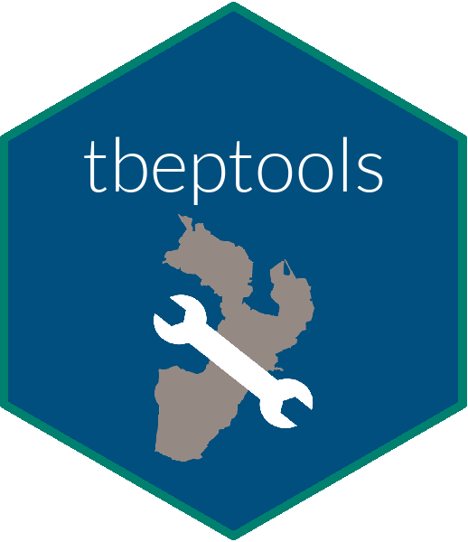

# tbeptools

[](https://github.com/tbep-tech/tbeptools/actions)
[](https://github.com/tbep-tech/tbeptools/actions)
[](https://codecov.io/gh/tbep-tech/tbeptools?branch=master)

R package for Tampa Bay Estuary Program functions. Please see the [vignette](https://tbep-tech.github.io/tbeptools/articles/intro.html) for a full description.



# Installation

The package can be installed from GitHub.

```r
install.packages('devtools')
devtools::install_github('tbep-tech/tbeptools')
```

# Issues and suggestions

Please report any issues and suggestions on the [issues link](https://github.com/tbep-tech/tbeptools/issues) for the repository.  A guide to posting issues can be found [here](.github/ISSUE_TEMPLATE.md).

# Contributing

Please view our [contributing](.github/CONTRIBUTING.md) guidelines for any changes or pull requests.
