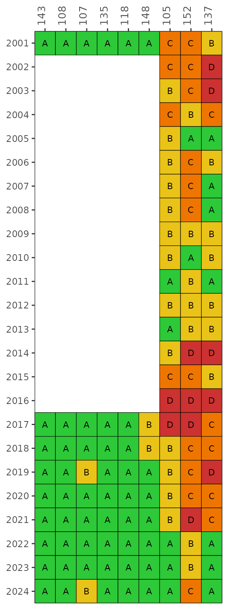
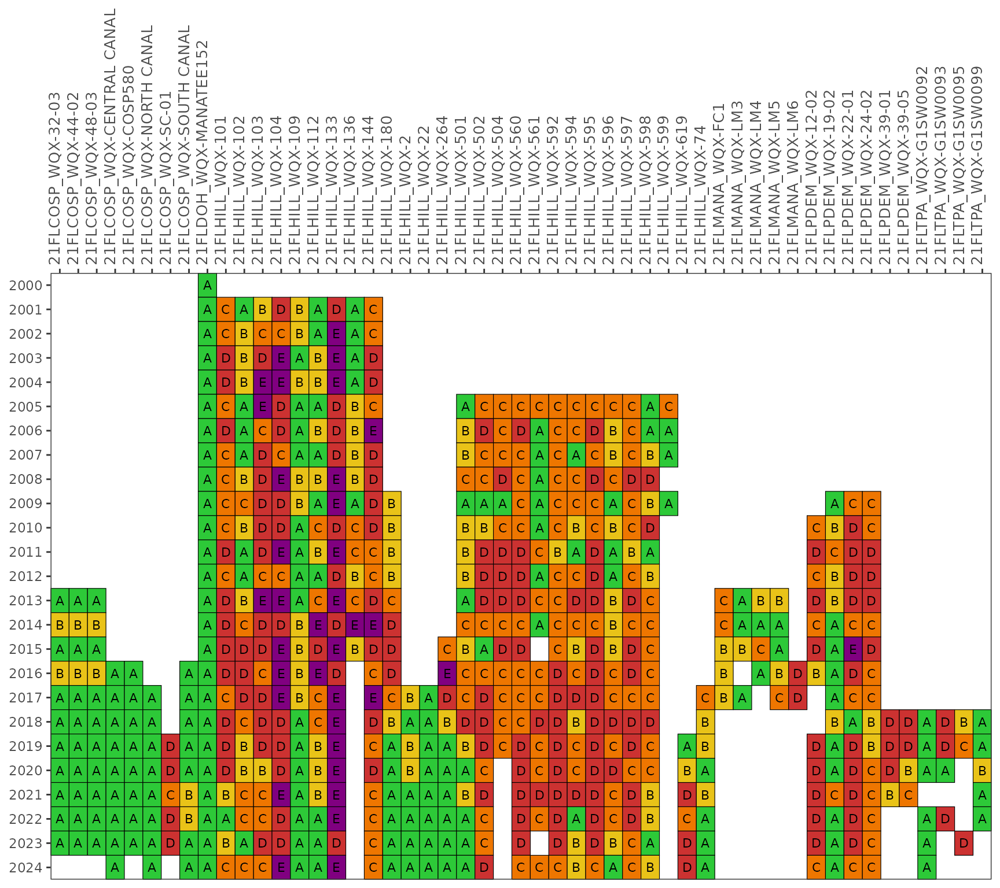
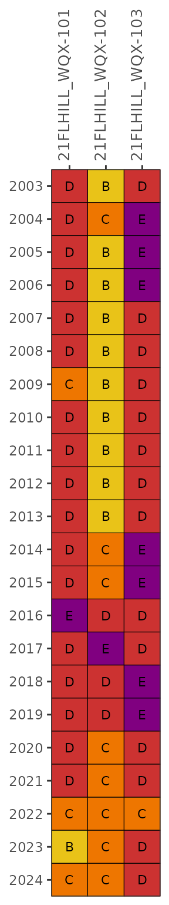
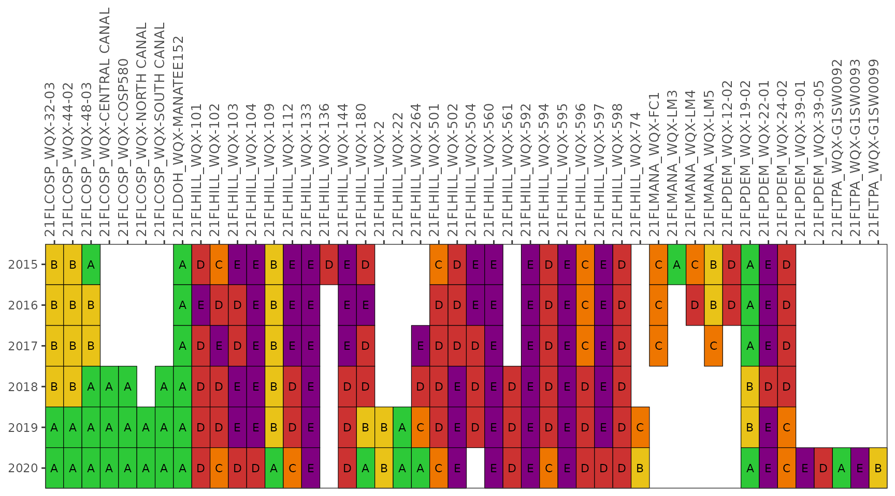

# Fecal Indicator Bacteria

### Background

Fecal Indicator Bacteria (FIB) are used to track concentrations of
pathogens in surface waters that may be detrimental to human health and
the environment. Exposure risk is commonly measured with select
indicators that are present in the human gut and can enter the
environment through wastewater discharges, stormwater, or other illicit
sources. Common indicators include concentrations of *E. coli*,
*Enterococcus*, or Fecal Coliform as the number of colony forming units
(CFU) per 100 mL of water.

Many monitoring programs routinely measure FIB concentrations at select
locations. The tbeptools package has several functions for importing and
reporting these data. Three workflows are available:

1.  Functions that use data exclusively from the Environmental
    Protection Commission (EPC) of Hillsborough County
2.  Functions that use data from Manatee, Pasco, Polk County, or
    Hillsborough County (Environmental Services Division)
3.  Functions that use data from several monitoring programs for baywide
    reporting focusing exclusively on *Enterococcus*

This vignette is organized around these three workflows. For all, the
assessments are meant to inform progress remediating fecal impairments
or to support prioritization of areas for further investigation. They
are not meant to support beach monitoring efforts or closures for
recreational uses - alternative reporting products are available for
that purpose (see [FLDOH Healthy
Beaches](https://www.floridahealth.gov/environmental-health/beach-water-quality/county-detail.html?County=Pinellas&Zip=33701-3109)
or the [Tampa Bay Recreational Water Quality
Map](https://tampabay.wateratlas.usf.edu/maps/recreational-water-quality-map/)).

### EPC reporting

The Environmental Protection Commission (EPC) of Hillsborough County has
been tracking FIB indicators for several decades as part of their
long-term monitoring. Functions in tbeptools can be used to download EPC
FIB data, analyze the results, and create summary maps or plots. Most of
these functions are focused on reporting for the Hillsborough River
fecal bacteria impairment and the associated Basin Management Action
Plan (BMAP). These tools can be used to track long-term changes in FIBs
in this basin to assess progress in reducing bacterial levels.

Data collected from the monitoring program are processed and maintained
in a spreadsheet titled
`RWMDataSpreadsheet_ThroughCurrentReportMonth.xlsx` available for direct
download
[here](https://epcbocc.sharepoint.com/:x:/s/Share/EYXZ5t16UlFGk1rzIU91VogBa8U37lh8z_Hftf2KJISSHg?e=8r1SUL&download=1)
and viewable
[here](https://epcbocc.sharepoint.com/:f:/s/Share/EiypSSYdsEFCi84Sv_6-t7kBUYaXiIqN0B1n2w57Z_V3kQ?e=NdZQcU).
These data include observations at all stations and for all parameters
throughout the period of record. FIB data are collected at most stations
where additional water quality data are collected. This is the same
dataset used for reporting on water quality indicators in Tampa Bay (see
the [water quality
data](https://tbep-tech.github.io/tbeptools/articles/intro.html)
vignette). The functions in tbeptools can be used to import and analyze
these data.

#### Read

The main function for importing EPC FIB data is
[`read_importfib()`](https://tbep-tech.github.io/tbeptools/reference/read_importfib.md).
This function downloads the latest file if one is not already available
at the location specified by the `xlsx` input argument. The function
operates similarly as
[`read_importwq()`](https://tbep-tech.github.io/tbeptools/reference/read_importwq.md)
for importing water quality data. Please refer to the [water quality
data](https://tbep-tech.github.io/tbeptools/articles/intro.html)
vignette for additional details on the import function.

The FIB data can be downloaded as follows:

``` r
fibdata <- read_importfib(xlsx = 'vignettes/current_data.xlsx', download_latest = T)
```

A data object called `fibdata` is also provided with the package,
although it may not contain the most current data available from EPC.
View the [help
file](https://tbep-tech.github.io/tbeptools/reference/fibdata.html) for
the download date.

``` r
fibdata
#> # A tibble: 29,175 × 18
#>    area   epchc_station class SampleTime             yr    mo Latitude Longitude
#>    <chr>          <dbl> <chr> <dttm>              <dbl> <dbl>    <dbl>     <dbl>
#>  1 Hills…             2 3M    2024-12-10 12:58:00  2024    12     27.9     -82.5
#>  2 Hills…             6 3M    2024-12-09 09:27:00  2024    12     27.9     -82.5
#>  3 Hills…             7 3M    2024-12-09 09:38:00  2024    12     27.9     -82.5
#>  4 Hills…             8 3M    2024-12-09 11:42:00  2024    12     27.9     -82.4
#>  5 Middl…             9 2     2024-12-09 11:02:00  2024    12     27.8     -82.4
#>  6 Middl…            11 2     2024-12-09 09:52:00  2024    12     27.8     -82.5
#>  7 Middl…            13 2     2024-12-09 10:04:00  2024    12     27.8     -82.5
#>  8 Middl…            14 2     2024-12-09 10:37:00  2024    12     27.8     -82.5
#>  9 Middl…            16 2     2024-12-16 09:44:00  2024    12     27.7     -82.5
#> 10 Middl…            19 2     2024-12-16 09:59:00  2024    12     27.7     -82.6
#> # ℹ 29,165 more rows
#> # ℹ 10 more variables: Total_Depth_m <dbl>, Sample_Depth_m <dbl>, ecoli <dbl>,
#> #   ecoli_q <chr>, entero <dbl>, entero_q <chr>, fcolif <dbl>, fcolif_q <chr>,
#> #   totcol <dbl>, totcol_q <chr>
```

The `fibdata` object includes monthly samples for FIB data at select
stations in the Hillsborough River basin. Some stations include samples
beginning in 1972. The default output for
[`read_importfib()`](https://tbep-tech.github.io/tbeptools/reference/read_importfib.md)
returns all stations with FIB data from EPC. If `all = F` for
[`read_importfib()`](https://tbep-tech.github.io/tbeptools/reference/read_importfib.md),
only stations with `AreaName` as Hillsborough River, Hillsborough River
Tributary, Alafia River, Alafia River Tributary, Lake Thonotosassa, Lake
Thonotosassa Tributary, and Lake Roberta are returned. Values are
returned for *E. coli* (`ecoli`), *Enterococcus* (`entero`), Fecal
Coliform (`fcolif`), and Total Coliform (`totcol`). Units are \# of
colonies per 100 mL of water (`#/100mL`). Qualifier columns for each are
also returned with the `_q` suffix. Consult the source spreadsheet for
interpretation of these codes. Concentrations noted with `<` (below
detection) or `>` (above detection) in the raw data are reported as the
detection limit.

The `fibdata` object can be used for the remaining FIB functions.

#### Analyze

Several analysis functions are provided for working with the EPC data.
These functions are used internally by the `show` functions described
below, but are presented here for an explanation of how the data are
processed.

The
[`anlz_fibmap()`](https://tbep-tech.github.io/tbeptools/reference/anlz_fibmap.md)
function assigns categories to each observation in `fibdata` for a
selected month and year. These results are then mapped using
[`anlz_fibmap()`](https://tbep-tech.github.io/tbeptools/reference/anlz_fibmap.md)
(see below). The categories are specific to *E. coli* or *Enterococcus*
and are assigned based on the station class as freshwater (`class` as 1
or 3F) or marine (`class` as 2 or 3M), respectively. A station is
categorized into one of four ranges defined by the thresholds as noted
in the `cat` column of the output, with corresponding colors appropriate
for each range as noted in the `col` column of the output.

``` r
anlz_fibmap(fibdata)
#> # A tibble: 29,175 × 12
#>    area    station class    yr    mo Latitude Longitude ecoli entero ind   cat  
#>    <chr>     <dbl> <chr> <dbl> <dbl>    <dbl>     <dbl> <dbl>  <dbl> <chr> <fct>
#>  1 Hillsb…       2 3M     2024    12     27.9     -82.5    NA     28 Ente… < 35 
#>  2 Hillsb…       6 3M     2024    12     27.9     -82.5    NA      2 Ente… < 35 
#>  3 Hillsb…       7 3M     2024    12     27.9     -82.5    NA      2 Ente… < 35 
#>  4 Hillsb…       8 3M     2024    12     27.9     -82.4    NA      2 Ente… < 35 
#>  5 Middle…       9 2      2024    12     27.8     -82.4    NA      4 Ente… < 35 
#>  6 Middle…      11 2      2024    12     27.8     -82.5    NA      2 Ente… < 35 
#>  7 Middle…      13 2      2024    12     27.8     -82.5    NA      2 Ente… < 35 
#>  8 Middle…      14 2      2024    12     27.8     -82.5    NA      2 Ente… < 35 
#>  9 Middle…      16 2      2024    12     27.7     -82.5    NA      2 Ente… < 35 
#> 10 Middle…      19 2      2024    12     27.7     -82.6    NA      2 Ente… < 35 
#> # ℹ 29,165 more rows
#> # ℹ 1 more variable: col <chr>
```

The ranges (number of samples / 100 mL) are from EPC and are as follows
for *E. coli* or *Enterococcus*.

| Indicator    | Color  | Range     |
|:-------------|:-------|:----------|
| E. coli      | Green  | \< 126    |
|              | Yellow | 126 - 409 |
|              | Orange | 410 - 999 |
|              | Red    | \> 999    |
| Enterococcus | Green  | \< 35     |
|              | Yellow | 35 - 129  |
|              | Orange | 130 - 999 |
|              | Red    | \> 999    |

The `yrsel` and `mosel` arguments can be used to filter results by year
and month. Not specifying these arguments will return results for the
entire period of record.

``` r
anlz_fibmap(fibdata, yrsel = 2023, mosel = 7)
#> # A tibble: 150 × 12
#>    area    station class    yr    mo Latitude Longitude ecoli entero ind   cat  
#>    <chr>     <dbl> <chr> <dbl> <dbl>    <dbl>     <dbl> <dbl>  <dbl> <chr> <fct>
#>  1 Hillsb…       2 3M     2023     7     27.9     -82.5    NA    800 Ente… 130 …
#>  2 Hillsb…       6 3M     2023     7     27.9     -82.5    NA      2 Ente… < 35 
#>  3 Hillsb…       7 3M     2023     7     27.9     -82.5    NA      2 Ente… < 35 
#>  4 Hillsb…       8 3M     2023     7     27.9     -82.4    NA      2 Ente… < 35 
#>  5 Middle…       9 2      2023     7     27.8     -82.4    NA      2 Ente… < 35 
#>  6 Middle…      11 2      2023     7     27.8     -82.5    NA      2 Ente… < 35 
#>  7 Middle…      13 2      2023     7     27.8     -82.5    NA      2 Ente… < 35 
#>  8 Middle…      14 2      2023     7     27.8     -82.5    NA      2 Ente… < 35 
#>  9 Middle…      16 2      2023     7     27.7     -82.5    NA      2 Ente… < 35 
#> 10 Middle…      19 2      2023     7     27.7     -82.6    NA      2 Ente… < 35 
#> # ℹ 140 more rows
#> # ℹ 1 more variable: col <chr>
```

The `areasel` argument can indicate either `"Alafia"` or
`"Hillsborough"` to select stations in the corresponding river basins,
where rows in `fibdata` are filtered based on the selection. All
stations are returned if this argument is `NULL` (default). The Alafia
River basin includes values in the `area` column of `fibdata` as
`"Alafia River"` and `"Alafia River Tributary"`. The Hillsborough River
basin includes values in the `area` column of `fibdata` as
`"Hillsborough River"`, `"Hillsborough River Tributary"`,
`"Lake Thonotosassa"`, `"Lake Thonotosassa Tributary"`, and
`"Lake Roberta"`. Not all areas may be present based in the selection
for `yrsel` and `mosel`. All valid options for `areasel` include
`"Alafia River"`, `"Hillsborough River"`, `"Cockroach Bay"`,
`"East Lake Outfall"`, `"Hillsborough Bay"`, `"Little Manatee"`,
`"Lower Tampa Bay"`, `"McKay Bay"`, `"Middle Tampa Bay"`,
`"Old Tampa Bay"`, `"Palm River"`, `"Tampa Bypass Canal"`, or
`"Valrico Lake"`.

``` r
anlz_fibmap(fibdata, yrsel = 2023, mosel = 7, areasel = 'Hillsborough River')
#> # A tibble: 37 × 12
#>    area    station class    yr    mo Latitude Longitude ecoli entero ind   cat  
#>    <chr>     <dbl> <chr> <dbl> <dbl>    <dbl>     <dbl> <dbl>  <dbl> <chr> <fct>
#>  1 Hillsb…       2 3M     2023     7     27.9     -82.5    NA    800 Ente… 130 …
#>  2 Hillsb…     105 3M     2023     7     28.0     -82.4    NA    128 Ente… 35 -…
#>  3 Hillsb…     106 1      2023     7     28.1     -82.4   144    232 E. c… 126 …
#>  4 Lake T…     107 3F     2023     7     28.0     -82.3   570   1550 E. c… 410 …
#>  5 Hillsb…     108 3F     2023     7     28.1     -82.2   187    276 E. c… 126 …
#>  6 Lake T…     118 3F     2023     7     28.1     -82.3     4      7 E. c… < 126
#>  7 Hillsb…     120 3F     2023     7     28.1     -82.4   100    410 E. c… < 126
#>  8 Lake T…     135 3F     2023     7     28.1     -82.3     4      4 E. c… < 126
#>  9 Hillsb…     137 3M     2023     7     28.0     -82.5    NA    680 Ente… 130 …
#> 10 Hillsb…     143 3F     2023     7     28.1     -82.1   800   1333 E. c… 410 …
#> # ℹ 27 more rows
#> # ℹ 1 more variable: col <chr>
```

The
[`anlz_fibmatrix()`](https://tbep-tech.github.io/tbeptools/reference/anlz_fibmatrix.md)
function creates a summary of FIB categories by station and year as
output for the
[`show_fibmatrix()`](https://tbep-tech.github.io/tbeptools/reference/show_fibmatrix.md)
function described below. The function assigns Microbial Water Quality
Assessment (MWQA) letter categories for each station and year based on
the likelihood that *Enterococcus* (marine) concentrations will exceed
130 CFU / 100 mL or *E. coli* (fresh) concentrations will exceed 410 CFU
/ 100 mL. By default, the results for each year are based on a
right-centered window that uses the previous two years and the current
year to calculate probabilities from the monthly samples (`lagyr = 3`).
The columns for each station and year include the estimated geometric
mean of the indicator concentrations (`gmean`) and a category indicating
a letter outcome based on the likelihood of exceedences (`cat`).

``` r
anlz_fibmatrix(fibdata)
#> # A tibble: 102 × 7
#>       yr grp   class  gmean Latitude Longitude cat  
#>    <dbl> <fct> <chr>  <dbl>    <dbl>     <dbl> <chr>
#>  1  2003 105   Marine  97.1     28.0     -82.4 C    
#>  2  2003 152   Marine 266.      28.0     -82.5 D    
#>  3  2003 137   Marine 342.      28.0     -82.5 D    
#>  4  2004 105   Marine 216.      28.0     -82.4 C    
#>  5  2004 152   Marine 246.      28.0     -82.5 C    
#>  6  2004 137   Marine 302.      28.0     -82.5 D    
#>  7  2005 105   Marine 117.      28.0     -82.4 C    
#>  8  2005 152   Marine  91.7     28.0     -82.5 C    
#>  9  2005 137   Marine  66.6     28.0     -82.5 C    
#> 10  2006 105   Marine  90.7     28.0     -82.4 C    
#> # ℹ 92 more rows
```

#### Show

The
[`show_fibmap()`](https://tbep-tech.github.io/tbeptools/reference/show_fibmap.md)
function creates a map of FIB sites and thresholds based on output from
[`anlz_fibmap()`](https://tbep-tech.github.io/tbeptools/reference/anlz_fibmap.md).
The same arguments that apply to
[`anlz_fibmap()`](https://tbep-tech.github.io/tbeptools/reference/anlz_fibmap.md)
also apply to
[`show_fibmap()`](https://tbep-tech.github.io/tbeptools/reference/show_fibmap.md)
such that freshwater and marine stations categorized by relevant
thresholds are plotted by a selected year, month, and area (if
provided). Unlike
[`anlz_fibmap()`](https://tbep-tech.github.io/tbeptools/reference/anlz_fibmap.md),
the `yrsel` and `mosel` arguments are required.

``` r
show_fibmap(fibdata, yrsel = 2023, mosel = 7, areasel = NULL)
```

Sites for the Hillsborough or Alafia river basins can be shown using the
`areasel` argument.

``` r
show_fibmap(fibdata, yrsel = 2023, mosel = 7, areasel = 'Hillsborough River')
```

``` r
show_fibmap(fibdata, yrsel = 2023, mosel = 7, areasel = 'Alafia River')
```

Additional information about a site can be seen by placing the cursor
over a location. A map inset can also be seen by clicking the arrow on
the bottom left of the map.

The
[`show_fibmatrix()`](https://tbep-tech.github.io/tbeptools/reference/show_fibmatrix.md)
function creates a stoplight graphic of summarized FIB data at selected
stations for each year of available data \[1\]. The matrix colors are
based on the likelihood that fecal bacteria concentrations exceed 130
CFU / 100 mL for *Enterococcus* (marine) and 410 CFU / 100 mL for *E.
coli* (fresh). The likelihoods are categorized as A, B, C, D, or E
(Microbial Water Quality Assessment or MWQA categories) with
corresponding colors, where the breakpoints for each category are \<10%,
10-30%, 30-50%, 50-75%, and \>75% (right-closed) likelihood of
exceedence. Methods and rationale for this categorization scheme are
provided by the Florida Department of Environmental Protection, Figure 8
in \[2\] and \[1\].

``` r
show_fibmatrix(fibdata)
```


By default, the results for each year are based on a right-centered
window that uses the previous two years and the current year to
calculate probabilities from the monthly samples (`lagyr = 3`). This
example shows results using only the monthly observations in each year.

``` r
show_fibmatrix(fibdata, lagyr = 1)
```



The default stations are those used in TBEP report \#05-13 \[3\] for the
Hillsborough River Basin Management Action Plan (BMAP) subbasins. These
include Blackwater Creek (WBID 1482, EPC stations 143, 108), Baker Creek
(WBID 1522C, EPC station 107), Lake Thonotosassa (WBID 1522B, EPC
stations 135, 118), Flint Creek (WBID 1522A, EPC station 148), and the
Lower Hillsborough River (WBID 1443E, EPC stations 105, 152, 137). Other
stations in `fibdata` can be plotted using the `stas` argument.

``` r
show_fibmatrix(fibdata, stas = c(115, 116))
```


The `yrrng` argument can also be used to select a year range, where the
default is years with sufficient data for *Enterococcus* at marine
stations and *E. coli* for freshwater stations.

``` r
show_fibmatrix(fibdata, yrrng = c(2010, 2020))
```


If preferred, the matrix can also be returned in an HTML table that can
be sorted and scrolled by setting `asreact = TRUE`. Only the first ten
rows are shown by default. The default number of rows (10) can be
changed with the `nrows` argument. Use a sufficiently large number to
show all rows.

``` r
show_fibmatrix(fibdata, asreact = TRUE)
```

A plotly (interactive, dynamic plot) object can be returned by setting
`plotly = TRUE`.

``` r
show_fibmatrix(fibdata, plotly = TRUE)
```

Finally, a map of station categories from the report card for a given
year can be plotted using
[`show_fibmatmap()`](https://tbep-tech.github.io/tbeptools/reference/show_fibmatmap.md).
The `yrsel` argument is required, and the `areasel` argument can be used
to select a specific area. The values shown on the map are the same as
those for the respective year in the
[`show_fibmatrix()`](https://tbep-tech.github.io/tbeptools/reference/show_fibmatrix.md)
function.

``` r
show_fibmatmap(fibdata, yrsel = 2020, areasel = c('Hillsborough River', 'Alafia River'))
```

### Manatee, Pasco, Polk, or Hillsborough County reporting

FIB data from Manatee, Pasco, Polk, and Hillsborough (Environmental
Services Division) County can also be used with the above functions.
These data can be downloaded from the USEPA Water Quality Portal API as
follows, replacing the first argument with the appropriate organization
identifier (i.e., Manatee County `21FLMANA_WQP`, Pasco County
`21FLPASCO_WQP`, Polk County `21FLPOLK_WQP`).

``` r
mancofibdata <- read_importwqp(org = '21FLMANA_WQX', type = 'fib')
```

For convenience, data objects with the same naming convention as above
are included with tbeptools for use with all FIB functions
(`mancofibdata`, `pascofibdata`, `polcofibdata`, `hcesdfibdata`). Note
that
[`read_importwqp()`](https://tbep-tech.github.io/tbeptools/reference/read_importwqp.md)
can be used to download FIB data from other organizations, although the
FIB functions will only work with data from Manatee County.

Similar workflows as for the EPCHC data can be used. Examples of the
functions using the Manatee County data are below. The same
functionality can be used with the other county datasets.

``` r
show_fibmap(mancofibdata, yrsel = 2023, mosel = 7, areasel = NULL)
```

``` r
show_fibmatrix(mancofibdata, plotly = TRUE)
```

``` r
show_fibmatmap(mancofibdata, yrsel = 2020, areasel = 'Manatee River')
```

### Baywide reporting

The second workflow uses a baywide approach to summarize FIB data.
Select stations were identified at downstream locations that drain into
Tampa Bay and considered important watershed endpoints for FIB
monitoring. *Enterococcus* is the primary indicator because these
stations are located at terminal downstream locations that are tidally
influenced (marine). The functions are organized similarly as the
reporting workflow above, with some unique functions for working with
data from these locations.

#### Read

The main function for importing *Enterococcus* data is
[`read_importentero()`](https://tbep-tech.github.io/tbeptools/reference/read_importentero.md).
This function retrieves data from the USEPA Water Quality Portal API.
The three arguments are `stas`, `startDate`, and `endDate`. The `stas`
argument can be left as `NULL` (default) to retrieve data from all
stations based on those in the `catchprecip` data object, described
below. The `startDate` and `endDate` arguments specify the date ranges
for retrieving data, where the input format for each is a character
string as `'YYYY-MM-DD'`.

``` r
read_importentero(startDate = '1995-01-01', endDate = '2023-12-31')
```

The data request can take some time and the `enterodata` data object is
provided with the package for use with all downstream functions. This
dataset includes all data from the 53 selected stations from 1995-2023.

``` r
head(enterodata)
#>            date   yr mo time time_zone     long_name bay_segment
#> 2018 2001-01-16 2001  1                Old Tampa Bay         OTB
#> 2019 2001-02-20 2001  2                Old Tampa Bay         OTB
#> 2020 2001-03-20 2001  3                Old Tampa Bay         OTB
#> 2021 2001-04-17 2001  4                Old Tampa Bay         OTB
#> 2022 2001-05-15 2001  5                Old Tampa Bay         OTB
#> 2023 2001-06-19 2001  6                Old Tampa Bay         OTB
#>               station entero entero_censored MDL entero_units qualifier
#> 2018 21FLHILL_WQX-101     80           FALSE  NA      #/100mL        NA
#> 2019 21FLHILL_WQX-101    360           FALSE  NA      #/100mL        NA
#> 2020 21FLHILL_WQX-101   3900           FALSE  NA      #/100mL        NA
#> 2021 21FLHILL_WQX-101     20           FALSE  NA      #/100mL        NA
#> 2022 21FLHILL_WQX-101     NA           FALSE  20                     NA
#> 2023 21FLHILL_WQX-101     NA           FALSE  20                     NA
#>      LabComments Latitude Longitude
#> 2018          NA  28.0248  -82.6316
#> 2019          NA  28.0248  -82.6316
#> 2020          NA  28.0248  -82.6316
#> 2021          NA  28.0248  -82.6316
#> 2022          NA  28.0248  -82.6316
#> 2023          NA  28.0248  -82.6316
```

The downstream functions also require precipitation data obtained using
the
[`read_importrain()`](https://tbep-tech.github.io/tbeptools/reference/read_importrain.md)
function. This function downloads daily precipitation data from the
Southwest Florida Water Management District (SWFWMD) rainfall [FTP
website](ftp://ftp.swfwmd.state.fl.us/pub/radar_rainfall/Daily_Data/).
For each station, daily cumulative rainfall is summarized for each
upstream catchment, where the catchments for each site are defined by
pixel locations used to describe the SWFWMD rainfall data. This
information is available in the `catchpixels` data object.

Rainfall data is downloaded by defining years and months of interest.

``` r
read_importrain(2021, catchpixels, mos = 1:12, quiet = F)
```

As for the `enterodata` data object, the `catchprecip` object is
provided with the package for use with all downstream functions. This
dataset includes daily rainfall data (inches) for the 53 selected
stations from 1995-2023. The rainfall data is used to define
*Enterococcus* samples as “wet” or “dry” based on default or
user-defined thresholds described below.

``` r
head(catchprecip)
#> # A tibble: 6 × 3
#>   station            date        rain
#>   <chr>              <date>     <dbl>
#> 1 21FLCOSP_WQX-32-03 1995-01-01 0    
#> 2 21FLCOSP_WQX-32-03 1995-01-02 0    
#> 3 21FLCOSP_WQX-32-03 1995-01-03 0    
#> 4 21FLCOSP_WQX-32-03 1995-01-04 0.389
#> 5 21FLCOSP_WQX-32-03 1995-01-05 0    
#> 6 21FLCOSP_WQX-32-03 1995-01-06 0.106
```

#### Analyze

Several analysis functions are provided for working with *Enterococcus*
data. These functions are used internally by the `show` functions
described below, but are presented here for an explanation of how the
data are processed.

Each function uses *Enterococcus* and precipitation data provided by the
`enterodata` and `catchprecip` data objects. The latter dataset is used
to define “wet” or “dry” samples with the premise that *Enterococcus*
concentrations are higher in wet weather and it may be useful to
distinguish these samples to assess progress in achieving water quality
restoration goals, i.e., rainfall may confound an assessment of
management efforts to reduce fecal contamination.

Each `anlz` function has optional arguments that define the
`temporal_window` and `wet_threshold` for defining “wet” or “dry”
samples, which are passed to the
[`anlz_fibwetdry()`](https://tbep-tech.github.io/tbeptools/reference/anlz_fibwetdry.md)
function. These arguments define a period of time preceding a sample
date and cumulative rainfall threshold within the time period that must
be met to define a sample as “wet”. These arguments default to two days
and half an inch, such that samples are defined as “wet” if they have
greater than half an inch of cumulative rainfall in the two days
preceding and including the sample date. The time and rainfall
thresholds can be changed by the user. Additionally, the `anlz`
functions can also treat all samples equally by ignoring any rainfall
data by setting `wetdry = FALSE`, which is the default behavior.

The
[`anlz_fibwetdry()`](https://tbep-tech.github.io/tbeptools/reference/anlz_fibwetdry.md)
function defines “wet” or “dry” samples as described above and returns
the original input dataset with three additional columns describing the
total rain (inches) on the day of sampling (`rain_sampleDay`), the total
rain in the period defined by the `temporal_window` argument
(`rain_total`), and whether the sample is “wet” or not as a logical
value (`wet_sample`).

``` r
anlz_fibwetdry(enterodata, catchprecip, temporal_window = 2, wet_threshold = 0.5)
#> # A tibble: 6,622 × 19
#>    date          yr    mo time  time_zone long_name   bay_segment station entero
#>    <date>     <dbl> <dbl> <chr> <chr>     <chr>       <chr>       <chr>    <dbl>
#>  1 2001-01-16  2001     1 ""    ""        Old Tampa … OTB         21FLHI…     80
#>  2 2001-02-20  2001     2 ""    ""        Old Tampa … OTB         21FLHI…    360
#>  3 2001-03-20  2001     3 ""    ""        Old Tampa … OTB         21FLHI…   3900
#>  4 2001-04-17  2001     4 ""    ""        Old Tampa … OTB         21FLHI…     20
#>  5 2001-05-15  2001     5 ""    ""        Old Tampa … OTB         21FLHI…     NA
#>  6 2001-06-19  2001     6 ""    ""        Old Tampa … OTB         21FLHI…     NA
#>  7 2001-07-24  2001     7 ""    ""        Old Tampa … OTB         21FLHI…   1300
#>  8 2001-08-21  2001     8 ""    ""        Old Tampa … OTB         21FLHI…    260
#>  9 2001-09-18  2001     9 ""    ""        Old Tampa … OTB         21FLHI…    420
#> 10 2001-10-16  2001    10 ""    ""        Old Tampa … OTB         21FLHI…    520
#> # ℹ 6,612 more rows
#> # ℹ 10 more variables: entero_censored <lgl>, MDL <int>, entero_units <chr>,
#> #   qualifier <lgl>, LabComments <lgl>, Latitude <dbl>, Longitude <dbl>,
#> #   rain_sampleDay <dbl>, rain_total <dbl>, wet_sample <lgl>
```

The remaining `anlz` functions are
[`anlz_enteromap()`](https://tbep-tech.github.io/tbeptools/reference/anlz_enteromap.md)
to prepare data for mapping and
[`anlz_fibmatrix()`](https://tbep-tech.github.io/tbeptools/reference/anlz_fibmatrix.md)
to prepare data for a score card. Both can optionally use
[`anlz_fibwetdry()`](https://tbep-tech.github.io/tbeptools/reference/anlz_fibwetdry.md)
to plot “wet” or “dry” samples, described further in the `show` section.

The
[`anlz_enteromap()`](https://tbep-tech.github.io/tbeptools/reference/anlz_enteromap.md)
function is an *Enterococcus*-specific analogue to the
[`anlz_fibmap()`](https://tbep-tech.github.io/tbeptools/reference/anlz_fibmap.md)
function described in the EPC section above. The function assigns
categories to each observation in the *Enterococcus* data frame, which
can be viewed for a given month and year using
[`show_enteromap()`](https://tbep-tech.github.io/tbeptools/reference/show_enteromap.md)
(analagous to
[`show_fibmap()`](https://tbep-tech.github.io/tbeptools/reference/show_fibmap.md)).
The categories are specific to *Enterococcus* in marine waters, and are
noted in the `cat` column of the output. Corresponding colors are in the
`col` column of the output.

``` r
anlz_enteromap(enterodata)
#> # A tibble: 6,622 × 12
#>    station     long_name    yr    mo Latitude Longitude entero cat   col   ind  
#>    <chr>       <chr>     <dbl> <dbl>    <dbl>     <dbl>  <dbl> <fct> <chr> <chr>
#>  1 21FLHILL_W… Old Tamp…  2001     1     28.0     -82.6     80 35 -… #E9C… Ente…
#>  2 21FLHILL_W… Old Tamp…  2001     2     28.0     -82.6    360 130 … #EE7… Ente…
#>  3 21FLHILL_W… Old Tamp…  2001     3     28.0     -82.6   3900 > 999 #CC3… Ente…
#>  4 21FLHILL_W… Old Tamp…  2001     4     28.0     -82.6     20 < 35  #2DC… Ente…
#>  5 21FLHILL_W… Old Tamp…  2001     5     28.0     -82.6     NA NA    NA    Ente…
#>  6 21FLHILL_W… Old Tamp…  2001     6     28.0     -82.6     NA NA    NA    Ente…
#>  7 21FLHILL_W… Old Tamp…  2001     7     28.0     -82.6   1300 > 999 #CC3… Ente…
#>  8 21FLHILL_W… Old Tamp…  2001     8     28.0     -82.6    260 130 … #EE7… Ente…
#>  9 21FLHILL_W… Old Tamp…  2001     9     28.0     -82.6    420 130 … #EE7… Ente…
#> 10 21FLHILL_W… Old Tamp…  2001    10     28.0     -82.6    520 130 … #EE7… Ente…
#> # ℹ 6,612 more rows
#> # ℹ 2 more variables: indnm <chr>, conc <dbl>
```

The ranges (number of samples / 100 mL) are from EPC and are as follows
for *Enterococcus*:

| Color  | Range     |
|:-------|:----------|
| Green  | \< 35     |
| Yellow | 35 - 129  |
| Orange | 130 - 999 |
| Red    | \> 999    |

The `yrsel` and `mosel` arguments can be used to filter results by year
and month. Not specifying these arguments will return results for the
entire period of record.

``` r
anlz_enteromap(enterodata, yrsel = 2020, mosel = 8)
#> # A tibble: 27 × 12
#>    station     long_name    yr    mo Latitude Longitude entero cat   col   ind  
#>    <chr>       <chr>     <dbl> <dbl>    <dbl>     <dbl>  <dbl> <fct> <chr> <chr>
#>  1 21FLHILL_W… Old Tamp…  2020     8     28.0     -82.6    220 130 … #EE7… Ente…
#>  2 21FLHILL_W… Old Tamp…  2020     8     28.0     -82.6     40 35 -… #E9C… Ente…
#>  3 21FLHILL_W… Old Tamp…  2020     8     28.0     -82.6     70 35 -… #E9C… Ente…
#>  4 21FLHILL_W… Old Tamp…  2020     8     28.0     -82.6     50 35 -… #E9C… Ente…
#>  5 21FLPDEM_W… Old Tamp…  2020     8     27.9     -82.7     20 < 35  #2DC… Ente…
#>  6 21FLHILL_W… Hillsbor…  2020     8     27.9     -82.4      8 < 35  #2DC… Ente…
#>  7 21FLHILL_W… Hillsbor…  2020     8     27.9     -82.4   1200 > 999 #CC3… Ente…
#>  8 21FLHILL_W… Hillsbor…  2020     8     27.8     -82.4    520 130 … #EE7… Ente…
#>  9 21FLHILL_W… Hillsbor…  2020     8     27.9     -82.5    190 130 … #EE7… Ente…
#> 10 21FLHILL_W… Hillsbor…  2020     8     27.9     -82.4     90 35 -… #E9C… Ente…
#> # ℹ 17 more rows
#> # ℹ 2 more variables: indnm <chr>, conc <dbl>
```

The `wetdry` argument can be used to determine whether a sample was
taken after a rain event (logical `wet_sample` column in output), based
on user-specified thresholds and a provided precipitation data object
(`catchprecip`). Below shows how to identify wet samples based on at
least 0.5 inches of rain occurring two days prior to and including the
sample date.

``` r
anlz_enteromap(enterodata, wetdry = TRUE, precipdata = catchprecip,
               temporal_window = 2, wet_threshold = 0.5)
#> # A tibble: 6,622 × 13
#>    station     long_name    yr    mo Latitude Longitude entero cat   col   ind  
#>    <chr>       <chr>     <dbl> <dbl>    <dbl>     <dbl>  <dbl> <fct> <chr> <chr>
#>  1 21FLHILL_W… Old Tamp…  2001     1     28.0     -82.6     80 35 -… #E9C… Ente…
#>  2 21FLHILL_W… Old Tamp…  2001     2     28.0     -82.6    360 130 … #EE7… Ente…
#>  3 21FLHILL_W… Old Tamp…  2001     3     28.0     -82.6   3900 > 999 #CC3… Ente…
#>  4 21FLHILL_W… Old Tamp…  2001     4     28.0     -82.6     20 < 35  #2DC… Ente…
#>  5 21FLHILL_W… Old Tamp…  2001     5     28.0     -82.6     NA NA    NA    Ente…
#>  6 21FLHILL_W… Old Tamp…  2001     6     28.0     -82.6     NA NA    NA    Ente…
#>  7 21FLHILL_W… Old Tamp…  2001     7     28.0     -82.6   1300 > 999 #CC3… Ente…
#>  8 21FLHILL_W… Old Tamp…  2001     8     28.0     -82.6    260 130 … #EE7… Ente…
#>  9 21FLHILL_W… Old Tamp…  2001     9     28.0     -82.6    420 130 … #EE7… Ente…
#> 10 21FLHILL_W… Old Tamp…  2001    10     28.0     -82.6    520 130 … #EE7… Ente…
#> # ℹ 6,612 more rows
#> # ℹ 3 more variables: indnm <chr>, conc <dbl>, wet_sample <lgl>
```

The `areasel` argument can indicate one or any of the major
subwatersheds in Tampa Bay (excluding Terra Ceia Bay where no data
exist). For example, use `Old Tampa Bay` for stations in the
subwatershed of Old Tampa Bay, where rows in `enterodata` are filtered
based on the selection. All stations are returned if this argument is
set as `NULL` (default). All valid options for `areasel` include
`"Old Tampa Bay"`, `"Hillsborough Bay"`, `"Middle Tampa Bay"`,
`"Lower Tampa Bay"`, `"Boca Ciega Bay"`, or `"Manatee River"`.

``` r
anlz_enteromap(enterodata, yrsel = 2023, mosel = 7, areasel = 'Old Tampa Bay')
#> # A tibble: 12 × 12
#>    station     long_name    yr    mo Latitude Longitude entero cat   col   ind  
#>    <chr>       <chr>     <dbl> <dbl>    <dbl>     <dbl>  <dbl> <fct> <chr> <chr>
#>  1 21FLHILL_W… Old Tamp…  2023     7     28.0     -82.6      5 < 35  #2DC… Ente…
#>  2 21FLHILL_W… Old Tamp…  2023     7     28.0     -82.6     30 < 35  #2DC… Ente…
#>  3 21FLHILL_W… Old Tamp…  2023     7     28.0     -82.6     70 35 -… #E9C… Ente…
#>  4 21FLHILL_W… Old Tamp…  2023     7     28.0     -82.6    220 130 … #EE7… Ente…
#>  5 21FLHILL_W… Old Tamp…  2023     7     28.0     -82.5     NA NA    NA    Ente…
#>  6 21FLHILL_W… Old Tamp…  2023     7     28.0     -82.6    467 130 … #EE7… Ente…
#>  7 21FLHILL_W… Old Tamp…  2023     7     28.0     -82.6   3900 > 999 #CC3… Ente…
#>  8 21FLPDEM_W… Old Tamp…  2023     7     28.0     -82.7    798 130 … #EE7… Ente…
#>  9 21FLPDEM_W… Old Tamp…  2023     7     27.9     -82.7    457 130 … #EE7… Ente…
#> 10 21FLPDEM_W… Old Tamp…  2023     7     27.9     -82.7   1860 > 999 #CC3… Ente…
#> 11 21FLPDEM_W… Old Tamp…  2023     7     27.9     -82.7     75 35 -… #E9C… Ente…
#> 12 21FLTPA_WQ… Old Tamp…  2023     7     28.0     -82.7   2613 > 999 #CC3… Ente…
#> # ℹ 2 more variables: indnm <chr>, conc <dbl>
```

The
[`anlz_fibmatrix()`](https://tbep-tech.github.io/tbeptools/reference/anlz_fibmatrix.md)
function is used with the
[`show_fibmatrix()`](https://tbep-tech.github.io/tbeptools/reference/show_fibmatrix.md)
function and is used similarly as for the EPC workflow described above.
The function assigns Microbial Water Quality Assessment (MWQA) letter
categories for each station and year based on the likelihood that
*Enterococcus* concentrations will exceed 130 CFU / 100 mL. By default,
the results for each year are based on a right-centered window that uses
the previous two years and the current year to calculate probabilities
from the monthly samples (`lagyr = 3`). The columns for each station and
year include the estimated geometric mean of fecal bacterial
concentrations (`gmean`) and a category indicating a letter outcome
based on the likelihood of exceedences (`cat`).

``` r
anlz_fibmatrix(enterodata)
#> # A tibble: 571 × 7
#>       yr grp                    class   gmean Latitude Longitude cat  
#>    <dbl> <fct>                  <chr>   <dbl>    <dbl>     <dbl> <chr>
#>  1  2002 21FLDOH_WQX-MANATEE152 Marine   13.6     27.5     -82.7 A    
#>  2  2003 21FLDOH_WQX-MANATEE152 Marine   18.9     27.5     -82.7 A    
#>  3  2003 21FLHILL_WQX-101       Marine  297.      28.0     -82.6 D    
#>  4  2003 21FLHILL_WQX-102       Marine  103.      28.0     -82.6 B    
#>  5  2003 21FLHILL_WQX-103       Marine  359.      28.0     -82.6 D    
#>  6  2003 21FLHILL_WQX-104       Marine 2327.      28.0     -82.6 D    
#>  7  2003 21FLHILL_WQX-109       Marine   36.6     27.9     -82.4 B    
#>  8  2003 21FLHILL_WQX-112       Marine   49.4     27.7     -82.4 B    
#>  9  2003 21FLHILL_WQX-133       Marine  829.      27.9     -82.4 E    
#> 10  2003 21FLHILL_WQX-136       Marine   60.7     27.7     -82.5 A    
#> # ℹ 561 more rows
```

#### Show

The
[`show_enteromap()`](https://tbep-tech.github.io/tbeptools/reference/show_enteromap.md)
function creates a map of *Enterococcus* sites and thresholds based on
output from
[`anlz_enteromap()`](https://tbep-tech.github.io/tbeptools/reference/anlz_enteromap.md).
The same arguments that apply to
[`anlz_enteromap()`](https://tbep-tech.github.io/tbeptools/reference/anlz_enteromap.md)
also apply to
[`show_enteromap()`](https://tbep-tech.github.io/tbeptools/reference/show_enteromap.md),
including classification of samples as ‘wet’ or not depending on
specified thresholds. Wet and dry samples are differentiated on the map
by their shapes. Unlike
[`anlz_enteromap()`](https://tbep-tech.github.io/tbeptools/reference/anlz_enteromap.md),
the `yrsel` and `mosel` arguments are required.

``` r
show_enteromap(enterodata, yrsel = 2020, mosel = 9)
```

``` r
show_enteromap(enterodata, yrsel = 2020, mosel = 9, wetdry = TRUE,
               temporal_window = 2, wet_threshold = 0.5)
```

Additional information about a site can be seen by placing the cursor
over a location. A map inset can also be seen by clicking the arrow on
the bottom left of the map.

Sites for specific areas can be shown using the `areasel` argument.

``` r
show_enteromap(enterodata, yrsel = 2023, mosel = 7, areasel = 'Old Tampa Bay')
```

The
[`show_fibmatrix()`](https://tbep-tech.github.io/tbeptools/reference/show_fibmatrix.md)
function creates a stoplight graphic of summarized FIB data at selected
stations for each year of available data. The matrix color codes years
and stations based on the likelihood of fecal indicator bacteria
concentrations exceeding 130 CFU / 100 mL for *Enterococcus*. The
likelihoods are categorized as A, B, C, D, or E (Microbial Water Quality
Assessment or MWQA categories) with corresponding colors, where the
breakpoints for each category are \<10%, 10-30%, 30-50%, 50-75%, and
\>75% (right-closed). Methods and rationale for this categorization
scheme are provided by the Florida Department of Environmental
Protection, Figure 8 in \[2\] and \[1\]. All stations are shown by
default.

``` r
show_fibmatrix(enterodata)
```


By default, the results for each year are based on a right-centered
window that uses the previous two years and the current year to
calculate probabilities from the monthly samples (`lagyr = 3`). This
example shows results using only the monthly observations in each year.

``` r
show_fibmatrix(enterodata, lagyr = 1)
```



Individual stations can be selectd using the `stas` argument.

``` r
show_fibmatrix(enterodata,
               stas = c('21FLHILL_WQX-101', '21FLHILL_WQX-102', '21FLHILL_WQX-103'))
```



The `yrrng` argument can also be used to select a year range, where the
default is the date range contained in the data.

``` r
show_fibmatrix(enterodata, yrrng = c(2015, 2020))
```



Note that the `subset_wetdry` argument can be used with
[`show_fibmatrix()`](https://tbep-tech.github.io/tbeptools/reference/show_fibmatrix.md)
to show only wet or dry samples based on the thresholds provided by
`temporal_window` and `wet_threshold`. However, this is not recommended
because the scores are probability-based and comparisons between wet or
dry samples may be misleading due to different sample sizes, and
therefore, power to detect the likelihood of exceeding the threshold.
Specifically, there are far fewer wet samples than dry and these samples
will generally receive higher grades due to lower power of the
statistical tests.

As for the EPC data, an HTML table can be returned with
[`show_fibmatrix()`](https://tbep-tech.github.io/tbeptools/reference/show_fibmatrix.md)
using `asreact = TRUE` and a plotly object can be returned using
`plotly = TRUE`. See the above section for examples of these outputs.

The
[`show_fibmatrix()`](https://tbep-tech.github.io/tbeptools/reference/show_fibmatrix.md)
function also supports baywide reporting by bay segment, unlike the EPC
data. The stations for the baywide reporting were selected specifically
as endpoints that drain directly into each bay segment and an aggregate
summary of the stations by bay segment can indicate the MWQA category.
The calculations are the same as by station, but the data are aggregated
by bay segment.

``` r
show_fibmatrix(enterodata, bay_segment = c('OTB', 'HB', 'MTB', 'LTB', 'BCB', 'MR'))
```


Finally, a map of station and bay segment categories for a given year
can be plotted using `show_fibmatrixmap()`. The `yrsel` argument is
required, and the `areasel` argument can be used to select a specific
area. The values shown on the map are the same as those for the
respective year in the
[`show_fibmatrix()`](https://tbep-tech.github.io/tbeptools/reference/show_fibmatrix.md)
function.

``` r
show_fibmatmap(enterodata, yrsel = 2020, areasel = c('OTB', 'HB', 'MTB', 'LTB', 'BCB', 'MR'))
```

### Retrieving additional FIB data

The
[`read_importwqp()`](https://tbep-tech.github.io/tbeptools/reference/read_importwqp.md)
function can be used to retrieve data from the USEPA Water Quality
Portal using an organization identifier. The data can be retrieved as
follows and will typically take less than one minute to download.

``` r
# get Manatee County data
mancodata <- read_importwqp(org = '21FLDOH_WQX', type = 'fib', trace = T)

# get Pinellas County data
pincodata <- read_importwqp(org = '21FLPDEM_WQX', type = 'fib', trace = T)
```

## References

\[1\]

G. Morrison, H. N. Swanson, V. J. Harwood, C. M. Wapnick, T. Hansen, H.
S. Greening, Using a ’Decision Matrix’ Approach to Develop a Fecal
Coliform BMAP for Impaired Waters in the Hillsborough River Watershed,
Tampa Bay Estuary Program, Tampa Bay Regional Planning Council, St.
Petersburg, Florida, 2009.

\[2\]

PBS & J, Terra Ceia Consulting, LLC, University of South Florida,
Development of a decision-support tool to support the implementation of
fecal coliform BMAPs in the Hillsborough River Watershed, Florida
Department of Environmental Protection, Jacksonville, Florida, 2008.
<http://publicfiles.dep.state.fl.us/DEAR/BMAP/Tampa/MST%20Report/Fecal%20BMAP%20DST%20Final%20Report%20--%20June%202008.pdf>.

\[3\]

E. Sherwood, G. Morrison, Hillsborough River Fecal Coliform BMAP Update
(2013), Tampa Bay Estuary Program, St. Petersburg, Florida, 2013.
<https://drive.google.com/file/d/1MZnK3cMzV7LRg6dTbCKX8AOZU0GNurJJ/view?usp=drivesdk>.
