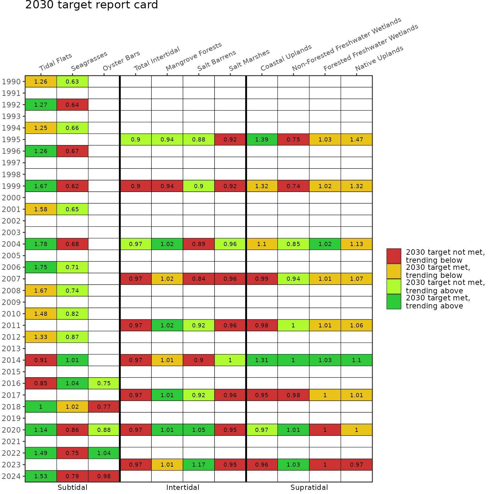
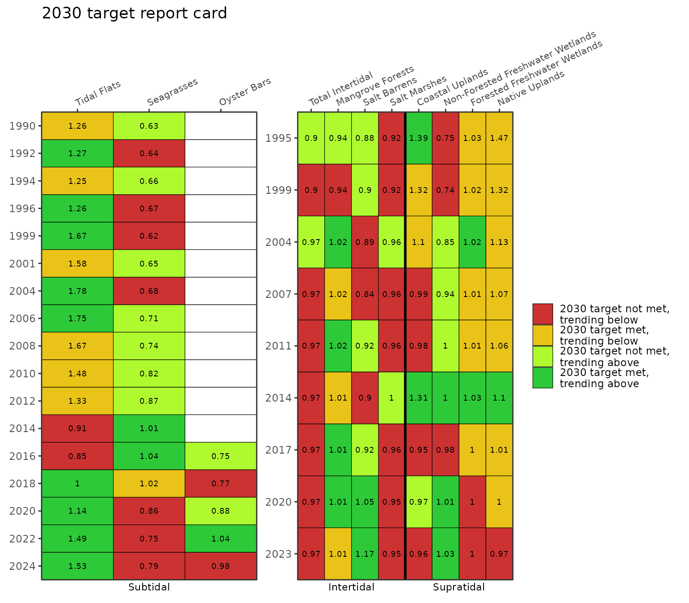

# Habitat Master Plan

### Background

Dashboard: <https://shiny.tbep.org/landuse-change/>

The habitats of Tampa Bay provide food, shelter, and other important
services that support birds, fish, mammals, and invertebrates.
Significant habitat alteration and loss has occurred with development
activities. To address these challenges, the Habitat Master Plan (2020
Update) \[1\] provides a set of targets and goals that, if achieved,
will provide a healthy and balanced coverage of native habitats in Tampa
Bay and its watershed.

This update builds on the previous Habitat Master Plan \[2\] in several
ways. The target and goal setting approach is informed by past changes
and over forty years of habitat restoration experience in the region.
The approach also identifies what is possible today rather than
replicating past ecological conditions and accounts for the potential
future effects of sea-level rise, climate change, and development. The
Habitat Master Plan defines 10-year (2030) habitat protection and
restoration targets and 30-year (2050) goals. Maps of habitat protection
and restoration opportunity areas where these targets and goals can be
attained are additional products available under the new plan. Please
visit <https://tbep.org/habitat-master-plan-update/> for additional
information.

### Datasets

Three internal datasets in tbeptools provide the necessary information
to create the Habitat Master Plan report card.

1.  Summary of annual acreage estimates for each major habitat type in
    intertidal and supratidal strata.

    ``` r
    acres
    #> # A tibble: 100 × 3
    #> # Groups:   name [10]
    #>    name  HMPU_TARGETS                       Acres
    #>    <chr> <chr>                              <dbl>
    #>  1 1990  Coastal Uplands                    5078.
    #>  2 1990  Developed                        372438.
    #>  3 1990  Forested Freshwater Wetlands     159561.
    #>  4 1990  Mangrove Forests                  13522.
    #>  5 1990  Native Uplands                   229990.
    #>  6 1990  Non-Forested Freshwater Wetlands  54454.
    #>  7 1990  Open Water                        38357.
    #>  8 1990  Restorable                       571513.
    #>  9 1990  Salt Barrens                        468 
    #> 10 1990  Salt Marshes                       4482.
    #> # ℹ 90 more rows
    ```

2.  Summary of annual acreage estimates for each major habitat type in
    the subtidal stratam.

    ``` r
    subtacres
    #> # A tibble: 69 × 3
    #>    name  HMPU_TARGETS    Acres
    #>    <chr> <chr>           <dbl>
    #>  1 1988  Open Water   197802. 
    #>  2 1988  Restorable       72.9
    #>  3 1988  Seagrasses    23279. 
    #>  4 1988  Tidal Flats   21686. 
    #>  5 1990  Open Water   197058. 
    #>  6 1990  Restorable       67.0
    #>  7 1990  Seagrasses    25218. 
    #>  8 1990  Tidal Flats   20433. 
    #>  9 1992  Open Water   195908. 
    #> 10 1992  Restorable       86.0
    #> # ℹ 59 more rows
    ```

3.  A table of targets and goals for each major habitat type, developed
    in the Habitat Master Plan 2020 update \[1\] (only select columns
    shown).

    ``` r
    hmptrgs[, c("Category", "HMPU_TARGETS", "Target2030", "Goal2050")]
    #>      Category                     HMPU_TARGETS Target2030 Goal2050
    #> 1    Subtidal                      Hard Bottom      423.0    423.0
    #> 2    Subtidal                 Artificial Reefs      166.0    166.0
    #> 3    Subtidal                      Tidal Flats    16220.0  16220.0
    #> 4    Subtidal                       Seagrasses    40000.0  40000.0
    #> 5    Subtidal                      Oyster Bars      221.0    471.0
    #> 6  Intertidal                Living Shorelines       21.3     56.3
    #> 7  Intertidal                 Total Intertidal    21353.0  23803.0
    #> 8  Intertidal                 Mangrove Forests    15300.0  15300.0
    #> 9  Intertidal                     Salt Barrens      546.0    796.0
    #> 10 Intertidal                     Salt Marshes     4807.0   5457.0
    #> 11 Intertidal                Tidal Tributaries        4.0     18.0
    #> 12 Supratidal                  Coastal Uplands     3769.0   4219.0
    #> 13 Supratidal Non-Forested Freshwater Wetlands    68937.0  71787.0
    #> 14 Supratidal     Forested Freshwater Wetlands   152282.0 152732.0
    #> 15 Supratidal                   Native Uplands   141050.0 142100.0
    ```

These datasets are created in the repository
<https://github.com/tbep-tech/hmpu-workflow> and require updates as land
use and cover datasets are produced every two to three years by the
Southwest Florida Water Management District.

### Report card summary

An important reporting product for the Habitat Master Plan is a report
card that summarizes attainment of targets and goals and evaluates prior
trends to identify if coverages are trending above or below the targets
or goals. Two functions are provided in tbeptools to create this report
card. The
[`anlz_hmpreport()`](https://tbep-tech.github.io/tbeptools/reference/anlz_hmpreport.md)
summarizes the above datasets to provide the necessary information for
creating the report card. The
[`show_hmpreport()`](https://tbep-tech.github.io/tbeptools/reference/show_hmpreport.md)
generates the plot for the report card. The latter can be used by itself
and the former is only provided if there is a need to view the data
behind the report card.

Using the
[`anlz_hmpreport()`](https://tbep-tech.github.io/tbeptools/reference/anlz_hmpreport.md)
function summarizes the acreage coverage estimates for each habitat
type, compares them to the targets and goals for each year of data, and
assesses the coverage trend between year pairs to determine if the
changes are trending above or below the targets and goals.

``` r
anlz_hmpreport(acres = acres, subtacres = subtacres, hmptrgs = hmptrgs)
#> # A tibble: 165 × 17
#>     year metric      Acres lacres   lyr category Target  Goal acresdiff yeardiff
#>    <dbl> <chr>       <dbl>  <dbl> <dbl> <fct>     <dbl> <dbl>     <dbl>    <dbl>
#>  1  1990 Seagrasses 25218. 23279.  1988 Subtidal  40000 40000     1939.        2
#>  2  1990 Tidal Fla… 20433. 21686.  1988 Subtidal  16220 16220    -1253.        2
#>  3  1992 Seagrasses 25746. 25218.  1990 Subtidal  40000 40000      528.        2
#>  4  1992 Tidal Fla… 20594. 20433.  1990 Subtidal  16220 16220      161.        2
#>  5  1994 Seagrasses 26524. 25746.  1992 Subtidal  40000 40000      778.        2
#>  6  1994 Tidal Fla… 20244. 20594.  1992 Subtidal  16220 16220     -349.        2
#>  7  1996 Seagrasses 26924. 26524.  1994 Subtidal  40000 40000      400.        2
#>  8  1996 Tidal Fla… 20443. 20244.  1994 Subtidal  16220 16220      199.        2
#>  9  1999 Seagrasses 24840. 26924.  1996 Subtidal  40000 40000    -2083.        3
#> 10  1999 Tidal Fla… 27085. 20443.  1996 Subtidal  16220 16220     6642.        3
#> # ℹ 155 more rows
#> # ℹ 7 more variables: changerate <dbl>, targetrate <dbl>, goalrate <dbl>,
#> #   targetprop <dbl>, goalprop <dbl>, targeteval <dbl>, goaleval <dbl>
```

The columns are as follows:

- **year**: Year of the assessment
- **metric**: Habitat type assessed
- **Acres**: Coverage estimate for the year
- **lacres**: Coverage estimate for the previous set of available data
- **lyr**: Year for the previous set of available data
- **category**: Strata for the habitat type
- **Target**: 2030 target for the habitat type from the Habitat Master
  Plan
- **Goal**: 2050 goal for the habitat type from the Habitat Master Plan
- **acresdiff**: Difference in acres for the current year and the
  previous set of available data
- **yeardiff**: Difference in years for the current year and the
  previous set of available data
- **changerate**: Acreage change per year for the current year relative
  to the previous set of available data
- **targetrate**: Annual rate required to achieve the 2030 target
- **goalrate**: Annual rate required to achieve the 2050 goal
- **targetprop**: Proportion of target met for the current year
- **goalprop**: Proportion of goal met for the current year
- **targeteval**: A number indicating target status of the current year
  for the report card
- **goaleval**: A number indicating goal status of the current year for
  the report card

The important columns in the output are `targetprop`, `goalprop`,
`targeteval`, and `goaleval`. The `targetprop` and `goalprop` columns
indicate the proportion of the target or goal met for habitat type in
the current assessment year. The `targeteval` and `goaleval` columns are
one of four values, as -1, 0, 0.5, and 1, for each habitat type and
year. These numbers define the habitat status for the assessment year:

- **-1**: target or goal not met, trending below
- **0**: target or goal met, trending below
- **0.5**: target or goal not met, trending above
- **1**: target or goal met, trending above

### Report card plot

The
[`show_hmpreport()`](https://tbep-tech.github.io/tbeptools/reference/show_hmpreport.md)
can be used to create the Habitat Master Plan report card. The
[`anlz_hmpreport()`](https://tbep-tech.github.io/tbeptools/reference/anlz_hmpreport.md)
function is used internally and does not need to be used separately. The
input files are the same.

The plot below shows the report card for the 2030 targets, using
`typ = "targets"`. The colors of each cell correspond to the numbers in
the `targeteval` column (or `goaleval` if `typ = "goals"`) returned by
[`anlz_hmpreport()`](https://tbep-tech.github.io/tbeptools/reference/anlz_hmpreport.md).
The numbers in each cell indicate the proportion of the target from
`targetprop` (or goal from `goalprop` if `typ = "goals"`) that is met
for each habitat type in each assessment year. Note that the creation of
datasets to generate the summaries is not continuous each year and
varies between the subtidal and inter/supratidal habitat.

``` r
show_hmpreport(acres = acres, subtacres = subtacres, hmptrgs = hmptrgs, typ = 'targets')
```



The 2050 goals report card can be shown using `typ = "goals"`.

``` r
show_hmpreport(acres = acres, subtacres = subtacres, hmptrgs = hmptrgs, typ = 'goals')
```


The subtidal data in `subtacres` and the inter/supratidal data in
`acres` are provided as different datasets by the Southwest Florida
Water Management District. The years in each dataset typically do not
match and each dataset is collected at approximate 2 to 3 year
intervals. By default, year on the y-axis is shown as a continuous
variable, where gaps are shown in years when each dataset was
unavailable. Use `ycollapse = TRUE` to remove years without data.

``` r
show_hmpreport(acres = acres, subtacres = subtacres, hmptrgs = hmptrgs, typ = 'targets', ycollapse = T)
```


Different strata can also be selected using the `strata` argument. Note
the use of `ycollapse = T` to remove years without data.

``` r
show_hmpreport(acres = acres, subtacres = subtacres, hmptrgs = hmptrgs, typ = 'targets', 
               strata = c('Intertidal', 'Supratidal'), ycollapse = T)
```


All strata can be combined in a single plot with collapsed years using
the patchwork library.

``` r
library(patchwork)
library(ggplot2) 

p1 <- show_hmpreport(acres = acres, subtacres = subtacres, hmptrgs = hmptrgs, typ = 'targets', 
               strata = 'Subtidal', ycollapse = T)
p2 <- show_hmpreport(acres = acres, subtacres = subtacres, hmptrgs = hmptrgs, typ = 'targets', 
               strata = c('Intertidal', 'Supratidal'), ycollapse = T) + labs(title = NULL)

p1 + p2 + plot_layout(ncol = 2, guides = 'collect')
```



The text showing the proportion of the target or goal met each year can
be suppressed using `text = NULL`. The size of the text can be changed
by entering a numeric value (default `text = 2.5`).

``` r
show_hmpreport(acres = acres, subtacres = subtacres, hmptrgs = hmptrgs, typ = 'targets', text = NULL)
```


An alternative form of the report card can be returned where the
attainment of targets or goals and the likelihood of attainment are
shown differently using colors and shapes, respectively. This is plotted
using `twocol = T`, where red shows the target or goal is not met, green
shows the target or goal is met, an up arrow shows the target or goal is
likely to be met, and a down arrow shows the target or goal is not
likely to be met.

``` r
show_hmpreport(acres = acres, subtacres = subtacres, hmptrgs = hmptrgs, typ = 'targets', twocol = T)
```


The report card provides no information on artificial reefs, living
shorelines, and hard bottom habitats. These habitats are not assessed in
routine data products from the Southwest Florida Water Management
District, although targets and goals are provided in the Habitat Master
Plan.

## References

\[1\]

D. Robison, T. Ries, J. Saarinen, D. Tomasko, C. Sciarrino, Tampa Bay
Estuary Program: 2020 Habitat Master Plan Update, Tampa Bay Estuary
Program, St. Petersburg, Florida, 2020.
<https://drive.google.com/file/d/1Hp0l_qtbxp1JxKJoGatdyuANSzQrpL0I/view?usp=drivesdk>.

\[2\]

D. Robison, Tampa Bay Estuary Program Habitat Master Plan Update, Tampa
Bay Estuary Program, St. Petersburg, Florida, 2010.
<https://drive.google.com/file/d/13iVkFKFG_EMNGwRWdgPPZfCL5JlatNcr/view?usp=drivesdk>.
