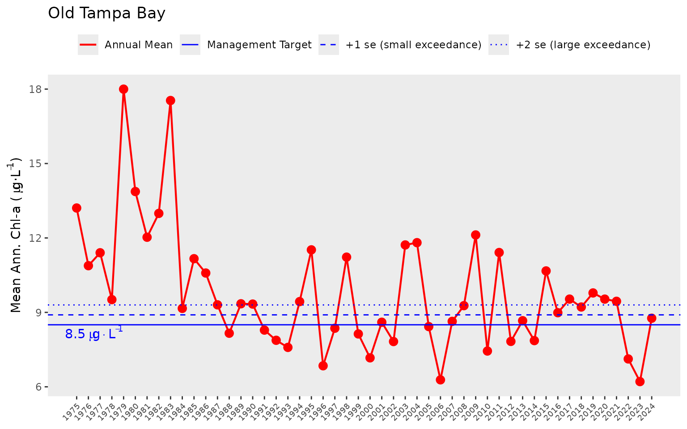
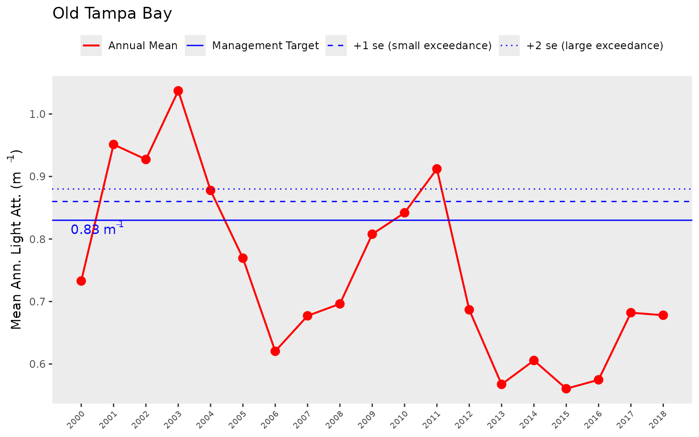
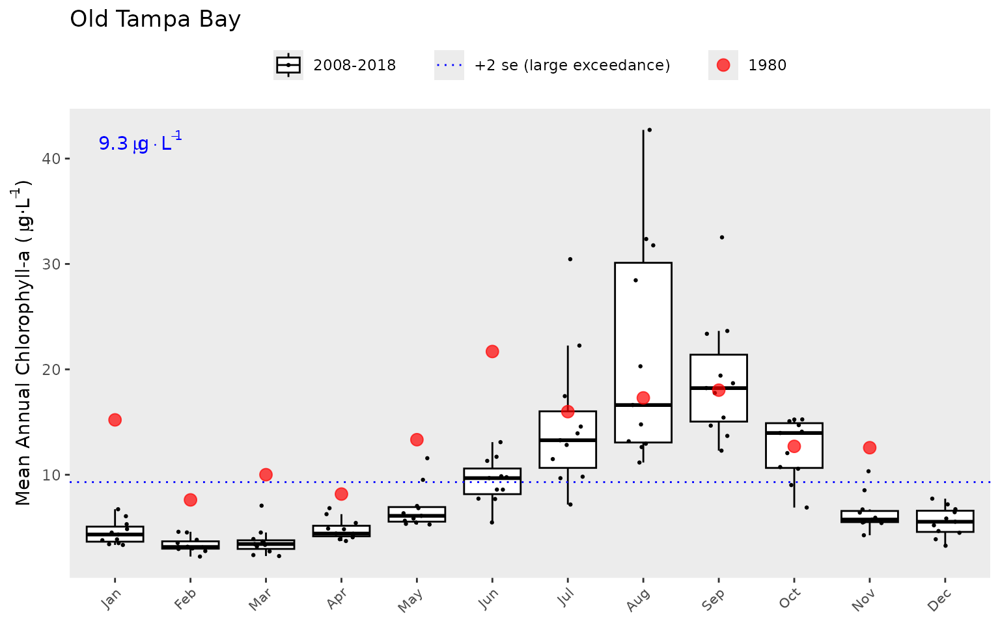
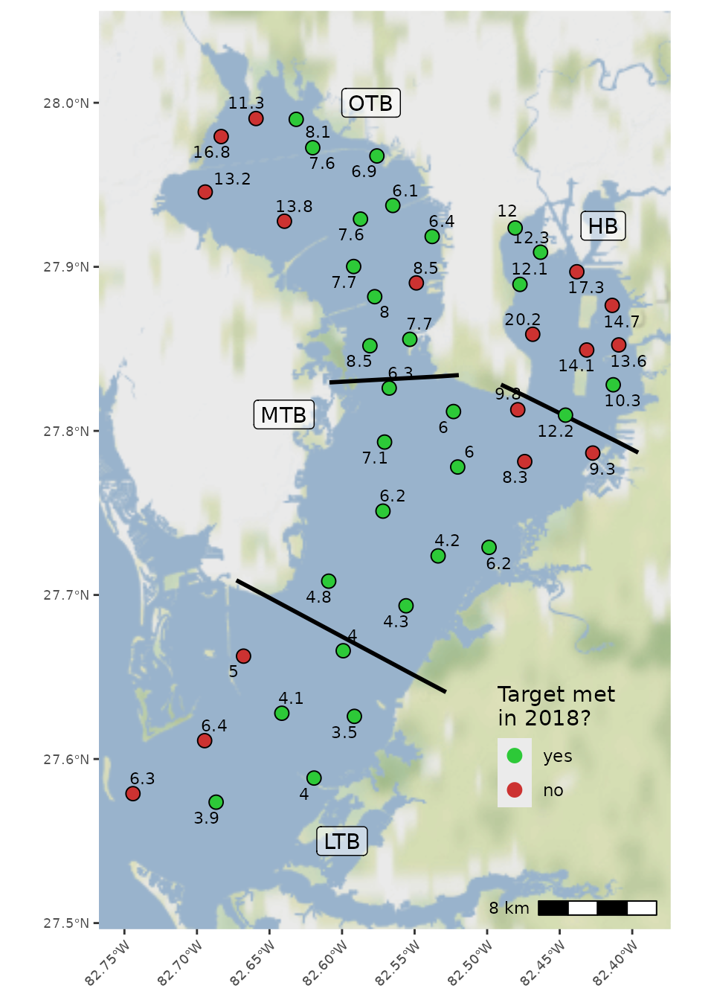

# Water Quality Data

### Background

Dashboard: <https://shiny.tbep.org/wq-dash>

This vignette provides an overview of the functions in tbeptools that
can be used to work with water quality data in Tampa Bay. View the other
vignettes for topical introductions to other reporting products (e.g.,
seagrasess, tidal creeks, etc.).

The environmental recovery of Tampa Bay is an exceptional success story
for coastal water quality management. Nitrogen loads in the mid 1970s
have been estimated at 8.2 million kg/yr, with approximately 5.5 million
kg/yr entering the upper Bay alone \[2\]. Reduced water clarity
associated with phytoplankton biomass contributed to a dramatic
reduction in the areal coverage of seagrass \[3\] and development of
hypoxic events, causing a decline in benthic faunal production \[4\].
Extensive efforts to reduce nutrient loads to the Bay occurred by the
late 1970s, with the most notable being improvements in infrastructure
for wastewater treatment in 1979. Improvements in water clarity and
decreases in chlorophyll concentrations were observed Bay-wide in the
1980s, with conditions generally remaining constant to present day
\[5\].

Tracking changes in environmental condition from the past to present day
would not have been possible without a long-term monitoring dataset.
Data have been collected monthly by the Environmental Protection
Commission of Hillsborough County since 1974 \[6,7\]. Samples are taken
at forty-five stations by water collection or monitoring sonde at
bottom, mid- or surface depths, depending on parameter. The locations of
monitoring stations are fixed and cover the entire Bay from the
uppermost mesohaline sections to the lowermost euhaline portions that
have direct interaction with the Gulf of Mexico. Up to 515 observations
are available for different parameters at each station, e.g., nitrogen,
chlorophyll-a, and secchi depth.

Data collected from the monitoring program are processed and maintained
in a spreadsheet titled
`RWMDataSpreadsheet_ThroughCurrentReportMonth.xlsx` at
<https://epcbocc.sharepoint.com/:x:/s/Share/EWKgPirIkoxMp9Hm_wVEICsBk6avI9iSRjFiOxX58wXzIQ?e=kAWZXl&download=1>
(viewable
[here](https://epcbocc.sharepoint.com/:f:/s/Share/EiypSSYdsEFCi84Sv_6-t7kBUYaXiIqN0B1n2w57Z_V3kQ?e=NdZQcU)).
These data include observations at all stations and for all parameters
throughout the period of record. To date, there have been no systematic
tools for importing, analyzing, and reporting information from these
data. The **tbeptools** package provides was developed to address this
need.


Locations of long-term monitoring stations in Tampa Bay. The Bay is
separated into four segments defined by chemical, physical, and
geopolitical boundaries.

### Read

The main function for importing water quality data is
[`read_importwq()`](https://tbep-tech.github.io/tbeptools/reference/read_importwq.md).
This function downloads the latest file if one is not already available
at the location specified by the `xlsx` input argument.

First, create a character path for the location of the file. If one does
not exist, specify a desired location and name for the downloaded file.
Here, we want to put the file in the vignettes folder and name is
current_results.xls. Note that this file path is relative to the root
working directly for the current R session. You can view the working
directory with [`getwd()`](https://rdrr.io/r/base/getwd.html).

``` r
xlsx <- 'vignettes/current_results.xlsx'
```

Now we pass this `xlsx` object to the
[`read_importwq()`](https://tbep-tech.github.io/tbeptools/reference/read_importwq.md)
function.

``` r
epcdata <- read_importwq(xlsx)
```

We get an error message from the function indicating that the file is
not found. This makes sense because the file doesn’t exist yet, so we
need to tell the function to download the latest file. This is done by
changing the `download_latest` argument to `TRUE` (the default is
`FALSE`).

``` r
epcdata <- read_importwq(xlsx, download_latest = TRUE)
```

    #> File vignettes/current_results.xlsx does not exist, replacing with downloaded file...

Now we get the same message, but with an indication that the file on the
server is being downloaded. We’ll have the data downloaded and saved to
the `epcdata` object after it finishes downloading.

If we try to run the function again after downloading the data from the
server, we get the following message. This check is done to make sure
that the data are not unnecessarily downloaded if the current file
matches the file on the server.

``` r
epcdata <- read_importwq(xlsx, download_latest = TRUE)
```

    #> File is current...

Every time that tbeptools is used to work with the monitoring data,
[`read_importwq()`](https://tbep-tech.github.io/tbeptools/reference/read_importwq.md)
should be used to import the data. You will always receive the message
`File is current...` if your local file matches the one on the server.
However, new data are regularly collected and posted on the server. If
`download_latest = TRUE` and your local file is out of date, you will
receive the following message:

    #> Replacing local file with current...

The argument `na` indicates which fields in the downloaded spreadsheet
are treated as blank values and assigned to `NA`. Any number of strings
can be added to this function to replace fields with `NA` values.

After the data are successfully imported, you can view them from the
assigned object:

``` r
epcdata
#> # A tibble: 29,041 × 26
#>    bay_segment epchc_station SampleTime             yr    mo Latitude Longitude
#>    <chr>               <dbl> <dttm>              <dbl> <dbl>    <dbl>     <dbl>
#>  1 HB                      6 2025-12-10 09:41:00  2025    12     27.9     -82.5
#>  2 HB                      7 2025-12-10 09:49:00  2025    12     27.9     -82.5
#>  3 HB                      8 2025-12-10 11:31:00  2025    12     27.9     -82.4
#>  4 MTB                     9 2025-12-10 11:00:00  2025    12     27.8     -82.4
#>  5 MTB                    11 2025-12-10 10:00:00  2025    12     27.8     -82.5
#>  6 MTB                    13 2025-12-10 10:10:00  2025    12     27.8     -82.5
#>  7 MTB                    14 2025-12-10 10:37:00  2025    12     27.8     -82.5
#>  8 MTB                    16 2025-12-17 09:26:00  2025    12     27.7     -82.5
#>  9 MTB                    19 2025-12-17 09:37:00  2025    12     27.7     -82.6
#> 10 LTB                    23 2025-12-17 12:03:00  2025    12     27.7     -82.6
#> # ℹ 29,031 more rows
#> # ℹ 19 more variables: Total_Depth_m <dbl>, Sample_Depth_m <dbl>, tn <dbl>,
#> #   tn_q <chr>, sd_m <dbl>, sd_raw_m <dbl>, sd_q <chr>, chla <dbl>,
#> #   chla_q <chr>, Sal_Top_ppth <dbl>, Sal_Mid_ppth <dbl>,
#> #   Sal_Bottom_ppth <dbl>, Temp_Water_Top_degC <dbl>,
#> #   Temp_Water_Mid_degC <dbl>, Temp_Water_Bottom_degC <dbl>,
#> #   `Turbidity_JTU-NTU` <chr>, Turbidity_Q <chr>, Color_345_F45_PCU <chr>, …
```

These data include the bay segment name, station number, sample time,
year, month, latitude, longitude, station depth, sample depth, total
nitrogen, secchi depth, chlorophyll, salinity, water temperature,
turbidity, and water color. All other parameters can be included by
setting `all = TRUE` in
[`read_importwq()`](https://tbep-tech.github.io/tbeptools/reference/read_importwq.md).

An import function is also available to download and format
phytoplankton cell count data. The
[`read_importphyto()`](https://tbep-tech.github.io/tbeptools/reference/read_importphyto.md)
function works similarly as the import function for the water quality
data. Start by specifying a path where the data should be downloaded and
set `download_latest` to `TRUE`. This function will download and
summarize data from the file
`PlanktonDataList_ThroughCurrentReportMonth.xlsx` on the EPC website.

``` r
xlsx <- 'phyto_data.xlsx'
phytodata <- read_importphyto(xlsx, download_latest = T)
```

    #> File vignettes/phyto_data.xlsx does not exist, replacing with downloaded file...

After the phytoplankton data are successfully imported, you can view
them from the assigned object:

``` r
phytodata
#> # A tibble: 42,812 × 8
#>    epchc_station Date       name  units  count yrqrt         yr mo   
#>    <chr>         <date>     <chr> <chr>  <dbl> <date>     <dbl> <ord>
#>  1 11            1975-07-23 other /0.1mL     0 1975-07-01  1975 Jul  
#>  2 11            1975-08-21 other /0.1mL     0 1975-07-01  1975 Aug  
#>  3 11            1975-09-17 other /0.1mL     0 1975-07-01  1975 Sep  
#>  4 11            1975-10-15 other /0.1mL     0 1975-10-01  1975 Oct  
#>  5 11            1975-11-12 other /0.1mL     0 1975-10-01  1975 Nov  
#>  6 11            1976-01-07 other /0.1mL     1 1976-01-01  1976 Jan  
#>  7 11            1976-02-03 other /0.1mL     0 1976-01-01  1976 Feb  
#>  8 11            1976-03-02 other /0.1mL     0 1976-01-01  1976 Mar  
#>  9 11            1976-03-31 other /0.1mL     0 1976-01-01  1976 Mar  
#> 10 11            1976-04-28 other /0.1mL     0 1976-04-01  1976 Apr  
#> # ℹ 42,802 more rows
```

These data are highly summarized from the raw data file available
online. Cell counts (as number of cells per 0.1mL) for selected taxa are
shown by date and quarter (i.e., Jan/Feb/Mar, Apr/May/Jun, etc.) for
each station. The quarter is indicated in the `yrqrt` column specified
by the starting date of each quarter (e.g., `1975-07-01` is the quarter
Jul/Aug/Sep for 1975). These data are primarily used to support analyses
in the water quality dashboard: <https://shiny.tbep.org/wq-dash/>

#### Retrieving additional water quality data

Most of the water quality functions in tbeptools were developed to work
with the long-term monitoring data from the Environmental Protection
Commission of Hillsborough County. Additional monitoring programs in
Tampa Bay can also be used to develop a more complete description of
water quality.

The
[`read_importwqp()`](https://tbep-tech.github.io/tbeptools/reference/read_importwqp.md)
function can be used to retrieve data from the USEPA Water Quality
Portal for data from monitoring organizations in and around the Tampa
Bay watershed. The function retrieves nutrient, chlorophyll, secchi,
temperature, salinity, and turbidity data for all available estuarine
stations monitored by each organization if `type = 'wq'`. The data can
be retrieved as follows and will typically take less than one minute to
download.

``` r
# get Manatee County data
mancodata <- read_importwqp(org = '21FLMANA_WQX', type = 'wq', trace = T)

# get Pinellas County data
pincodata <- read_importwqp(org = '21FLPDEM_WQX', type = 'wq', trace = T)
```

Additionally, data can be retrieved from the Tampa Bay Water Atlas API
(<https://dev.api.wateratlas.org/redoc/>) using two different functions.
These functions are generally quicker and more flexible than those from
the USEPA Water Quality Portal. The
[`util_importwqwa()`](https://tbep-tech.github.io/tbeptools/reference/util_importwqwa.md)
function retrieves metadata on the available information from the Water
Atlas API. This includes information on available data sources,
parameters, sampling stations, and waterbodies.

``` r
# data sources
util_importwqwa('dataSources')
#> # A tibble: 511 × 4
#>    dataSource              description                     name  fullMetadataUrl
#>    <chr>                   <chr>                           <chr> <chr>          
#>  1 21FLPOLK_WQ             "Polk County Natural Resources… Polk… NA             
#>  2 ACS_POP                 "The American Community Survey… Amer… https://www.ce…
#>  3 Aquaculture_Lease_Areas "CHNEP-generated map of aquacu… Char… https://chnep.…
#>  4 AUDUBON_CBC             "Audubon Christmas Bird Count … Audu… http://netapp.…
#>  5 CANALWATCH_WQ           "Cape Coral Canal Watch volunt… Cape… NA             
#>  6 CASSELBERRY_WQ          "Water quality data collected … Cass… NA             
#>  7 CCHMN                   "This dataset is used for Wate… Coas… NA             
#>  8 CCHMN_CAPECORAL         "This dataset is used for Wate… CCHM… NA             
#>  9 CCHMN_LEE               "This dataset is used for Wate… CCHM… NA             
#> 10 CCHMN_SWFWMD            "This dataset is used for Wate… CCHM… NA             
#> # ℹ 501 more rows

# parameters
util_importwqwa('parameters')
#> # A tibble: 928 × 6
#>    parameterID parameter                  units name  precision graphDisplayName
#>          <int> <chr>                      <chr> <chr>     <int> <chr>           
#>  1         413 1112Tetrachloroethane_dis… ug/l  1,1,…         2 1,1,1,2-Tetrach…
#>  2         412 1112Tetrachloroethane_ugl  ug/l  1,1,…         2 1,1,1,2-Tetrach…
#>  3          59 111Trichloroethane_diss_u… ug/l  1,1,…         2 1,1,1-Trichloro…
#>  4          58 111Trichloroethane_ugl     ug/l  1,1,…         2 1,1,1-Trichloro…
#>  5          63 1122Tetrachloroethane_dis… ug/l  1,1,…         2 1,1,2,2-Tetrach…
#>  6          62 1122Tetrachloroethane_ugl  ug/l  1,1,…         2 1,1,2,2-Tetrach…
#>  7          61 112Trichloroethane_diss_u… ug/l  1,1,…         2 1,1,2-Trichloro…
#>  8          60 112Trichloroethane_ugl     ug/l  1,1,…         2 1,1,2-Trichloro…
#>  9         240 11dichlorethylene_diss_ugl ug/l  1,1-…         2 1,1-Dichloroeth…
#> 10         239 11dichlorethylene_ugl      ug/l  1,1-…         2 1,1-Dichloroeth…
#> # ℹ 918 more rows

# stations, using optional waterbodyId argument for Hillsborough Bay
util_importwqwa('sampling-locations', waterbodyId = 20005)
#> # A tibble: 415 × 8
#>    dataSource       name  stationId latitude longitude waterBodyId waterBodyName
#>    <chr>            <chr> <chr>     <chr>    <chr>           <int> <chr>        
#>  1 USGS_NWIS        MCKA… 02301761  27.9153… -82.4234…       20005 Hillsborough…
#>  2 USGS_NWIS        MCKA… 02301843  27.9330… -82.4303…       20005 Hillsborough…
#>  3 USGS_NWIS        HILL… 02306032  27.8897… -82.4795…       20005 Hillsborough…
#>  4 EPC_ROUTINE_MON… Hill… 1041      27.9220… -82.4241…       20005 Hillsborough…
#>  5 EPC_ROUTINE_MON… Hill… 1150      27.9078… -82.4428…       20005 Hillsborough…
#>  6 EPC_ROUTINE_MON… Hill… 1160      27.9041… -82.4511…       20005 Hillsborough…
#>  7 EPC_ROUTINE_MON… Hill… 1170      27.8904… -82.4628…       20005 Hillsborough…
#>  8 EPC_ROUTINE_MON… Big … 14410     27.7778… -82.4063…       20005 Hillsborough…
#>  9 WIN_21FLHILL     14410 14410     27.7781… -82.4060…       20005 Hillsborough…
#> 10 WIN_21FLHILL     14415 14415     27.7796… -82.4122…       20005 Hillsborough…
#> # ℹ 405 more rows
#> # ℹ 1 more variable: county <chr>

# waterbodies
util_importwqwa('waterbodies')
#> # A tibble: 12,743 × 7
#>         id name              type  surfArea_Acres riverLength_Ft county altNames
#>      <int> <chr>             <chr>          <dbl>          <int> <chr>  <chr>   
#>  1    5963 149th Ave (04-08) Lake            3.09              0 Hills… NA      
#>  2   18802 17th Street Park… Lake            0.26              0 Saras… Pond DP…
#>  3   18801 17th Street Park… Lake            0.24              0 Saras… Pond DP…
#>  4   14870 17th Street Park… Noda…           0.71              0 Saras… Pond DP…
#>  5   18772 17th Street Pond… Lake            0.21              0 Saras… NA      
#>  6   18969 19th Street Pond  Lake            0.28              0 Saras… Pond CD…
#>  7   20200 22nd Street Pond  Lake            4.44              0 Hills… NA      
#>  8   18770 23rd Street Pond  Lake            0.38              0 Saras… NA      
#>  9 2003898 42-Foot Canal     River           0.19          37507 Glades C-4 Can…
#> 10     972 45th Ave NE Canal River          NA              5318 Pinel… NA      
#> # ℹ 12,733 more rows
```

The
[`read_importwqwa()`](https://tbep-tech.github.io/tbeptools/reference/read_importwqwa.md)
function retrieves the actual water quality data based on inputs for the
data source, parameter, and date ranges. The following shows how to
import chlorophyll data (uncorrected) from Pinellas County for January
of 2023. Consult the metadata using
[`util_importwqwa()`](https://tbep-tech.github.io/tbeptools/reference/util_importwqwa.md)
to determine available data sources and parameters.

``` r
read_importwqwa(dataSource = 'WIN_21FLPDEM', parameter = 'Chla_ugl', 
  start_date = '2023-01-01', end_date = '2023-01-31')
#> Requesting: WIN_21FLPDEM, Chla_ugl, 2023-01-01, 2023-01-31
#> Processing NDJSON stream...
#> # A tibble: 28 × 24
#>    dataSource   stationID actualStationID actualLatitude actualLongitude
#>    <chr>        <chr>     <chr>           <chr>          <chr>          
#>  1 WIN_21FLPDEM 08-03     08-03           28.06884265    -82.76802461   
#>  2 WIN_21FLPDEM 09-02     09-02           28.03412170    -82.77984738   
#>  3 WIN_21FLPDEM 18-06     18-06           27.97196562    -82.78145490   
#>  4 WIN_21FLPDEM 10-06     10-06           28.04126253    -82.75304796   
#>  5 WIN_21FLPDEM 10-02     10-02           28.04694745    -82.75892469   
#>  6 WIN_21FLPDEM 15-04     15-04           27.99051106    -82.78377469   
#>  7 WIN_21FLPDEM 53-06     53-06           28.10642699    -82.77355400   
#>  8 WIN_21FLPDEM 27-08     27-08           27.89148857    -82.82486245   
#>  9 WIN_21FLPDEM 17-03     17-03           27.94098330    -82.80113945   
#> 10 WIN_21FLPDEM 27-10     27-10           27.87980000    -82.80951000   
#> # ℹ 18 more rows
#> # ℹ 19 more variables: activityID <chr>, activityStartDate <date>,
#> #   activityStartTime <chr>, activityType <chr>, relativeDepth <chr>,
#> #   activityDepth <dbl>, activityDepthUnit <chr>, characteristic <chr>,
#> #   medium <chr>, sampleFraction <chr>, resultValue <dbl>, resultUnit <chr>,
#> #   mdl <chr>, mdlUnit <chr>, parameter <chr>, wBodyID <int>,
#> #   waterBodyName <chr>, resultComment <chr>, valueQualifier <chr>
```

### Analyze

The functions
[`anlz_avedat()`](https://tbep-tech.github.io/tbeptools/reference/anlz_avedat.md)
and
[`anlz_avedatsite()`](https://tbep-tech.github.io/tbeptools/reference/anlz_avedatsite.md)
summarize the station data by bay segments or by sites, respectively.
Both functions return annual means for chlorophyll and light attenuation
(based on Secchi depth measurements) and monthly means by year for
chlorophyll and light attenuation. These summaries are then used to
determine if bay segment targets for water quality are met using the
[`anlz_attain()`](https://tbep-tech.github.io/tbeptools/reference/anlz_attain.md)
and
[`anlz_attainsite()`](https://tbep-tech.github.io/tbeptools/reference/anlz_attainsite.md)
function.

Here we use
[`anlz_avedat()`](https://tbep-tech.github.io/tbeptools/reference/anlz_avedat.md)
to summarize the data by bay segment to estimate annual and monthly
means for chlorophyll and light attenuation. The output is a two-element
list for the annual (`ann`) and monthly (`mos`) means by segment.

``` r
avedat <- anlz_avedat(epcdata)
avedat
#> $ann
#> # A tibble: 632 × 4
#>       yr bay_segment var         val
#>    <dbl> <chr>       <chr>     <dbl>
#>  1  1974 HB          mean_chla 22.4 
#>  2  1974 LTB         mean_chla  4.24
#>  3  1974 MTB         mean_chla  9.66
#>  4  1974 OTB         mean_chla 10.2 
#>  5  1975 HB          mean_chla 27.9 
#>  6  1975 LTB         mean_chla  4.93
#>  7  1975 MTB         mean_chla 11.4 
#>  8  1975 OTB         mean_chla 13.2 
#>  9  1976 HB          mean_chla 29.5 
#> 10  1976 LTB         mean_chla  5.08
#> # ℹ 622 more rows
#> 
#> $mos
#> # A tibble: 4,916 × 5
#>    bay_segment    yr    mo var         val
#>    <chr>       <dbl> <dbl> <chr>     <dbl>
#>  1 HB           1974     1 mean_chla 36.2 
#>  2 LTB          1974     1 mean_chla  1.75
#>  3 MTB          1974     1 mean_chla 11.5 
#>  4 OTB          1974     1 mean_chla  4.4 
#>  5 HB           1974     2 mean_chla 42.4 
#>  6 LTB          1974     2 mean_chla  5.5 
#>  7 MTB          1974     2 mean_chla  9.35
#>  8 OTB          1974     2 mean_chla  4.07
#>  9 HB           1974     3 mean_chla 14.9 
#> 10 LTB          1974     3 mean_chla  5.88
#> # ℹ 4,906 more rows
```

This output can then be further analyzed with
[`anlz_attain()`](https://tbep-tech.github.io/tbeptools/reference/anlz_attain.md)
to determine if the bay segment outcomes are met in each year. The
results are used by the plotting functions described below. In short,
the `chl_la` column indicates the categorical outcome for chlorophyll
and light attenuation for each segment. The outcomes are integer values
from zero to three. The relative exceedances of water quality thresholds
for each segment, both in duration and magnitude, are indicated by
higher integer values.

``` r
anlz_attain(avedat)
#> # A tibble: 208 × 4
#>    bay_segment    yr chl_la outcome
#>    <chr>       <dbl> <chr>  <chr>  
#>  1 HB           1974 3_0    yellow 
#>  2 HB           1975 3_2    red    
#>  3 HB           1976 3_2    red    
#>  4 HB           1977 3_2    red    
#>  5 HB           1978 3_3    red    
#>  6 HB           1979 3_3    red    
#>  7 HB           1980 3_3    red    
#>  8 HB           1981 3_3    red    
#>  9 HB           1982 3_3    red    
#> 10 HB           1983 3_0    yellow 
#> # ℹ 198 more rows
```

Similar information can be obtained for individual sites using
[`anlz_avedatsite()`](https://tbep-tech.github.io/tbeptools/reference/anlz_avedatsite.md)
and
[`anlz_attainsite()`](https://tbep-tech.github.io/tbeptools/reference/anlz_attainsite.md).
The main difference is that a yes/no column `met`is added that indicates
only if the target was above or below the segment threshold for each
site.

``` r
anlz_avedatsite(epcdata) %>% anlz_attainsite
#> # A tibble: 2,340 × 9
#>       yr bay_segment epchc_station var     val target smallex thresh met  
#>    <dbl> <chr>               <dbl> <chr> <dbl>  <dbl>   <dbl>  <dbl> <chr>
#>  1  1974 HB                      6 chla   25.6   13.2    14.1     15 no   
#>  2  1974 HB                      7 chla   21.6   13.2    14.1     15 no   
#>  3  1974 HB                      8 chla   22.6   13.2    14.1     15 no   
#>  4  1974 HB                     44 chla   23.4   13.2    14.1     15 no   
#>  5  1974 HB                     52 chla   23.5   13.2    14.1     15 no   
#>  6  1974 HB                     55 chla   20.2   13.2    14.1     15 no   
#>  7  1974 HB                     70 chla   33.1   13.2    14.1     15 no   
#>  8  1974 HB                     71 chla   25.8   13.2    14.1     15 no   
#>  9  1974 HB                     73 chla   17.6   13.2    14.1     15 no   
#> 10  1974 HB                     80 chla   10.5   13.2    14.1     15 yes  
#> # ℹ 2,330 more rows
```

### Show

External package libraries in R can be used to plot the time series
data. Here’s an example using the popular
[ggplot2](https://ggplot2.tidyverse.org/) package. Some data wrangling
with the [dplyr](https://dplyr.tidyverse.org/) is done first to filter
the data we want to plot.

``` r
toplo <- epcdata %>% 
  filter(epchc_station == '52')

ggplot(toplo, aes(x = SampleTime, y = chla)) + 
  geom_line() + 
  geom_point() + 
  scale_y_log10() + 
  labs(
    y = 'Chlorophyll-a concentration (ug/L)', 
    x = NULL, 
    title = 'Chlorophyll trends',
    subtitle = 'Hillsborough Bay station 52, all dates'
    ) + 
  theme_bw()
```


The
[`show_thrplot()`](https://tbep-tech.github.io/tbeptools/reference/show_thrplot.md)
function provides a more descriptive assessment of annual trends for a
chosen bay segment relative to defined targets or thresholds. In this
plot we show the annual averages across stations Old Tampa bay
(`bay_segment = "OTB"`) for chlorophyll (`thr = "chla"`). The red line
shows annual trends and the horizontal blue lines indicate the
thresholds and targets for chlorophyll-a that are specific to Old Tampa
Bay. The dashed and dotted blue lines indicate +1 and +2 standard errors
for the management target shown by the filled line. The target and
standard errors are considered when identifying the annual segment
outcome for chlorophyll.

``` r
show_thrplot(epcdata, bay_segment = "OTB", thr = "chla")
```



We can show the same plot but for light attenuation by changing the
`thr = "chla"` to `thr = "la"`. Note the change in the horizontal
reference lines for the light attenuation target.

``` r
show_thrplot(epcdata, bay_segment = "OTB", thr = "la")
```


The year range to plot can also be specified using the `yrrng` argument,
where the default is the year range from `epcdata`.

``` r
show_thrplot(epcdata, bay_segment = "OTB", thr = "la", yrrng = c(2000, 2018))
```



The
[`show_thrplot()`](https://tbep-tech.github.io/tbeptools/reference/show_thrplot.md)
function uses results from the
[`anlz_avedat()`](https://tbep-tech.github.io/tbeptools/reference/anlz_avedat.md)
function. For example, you can retrieve the values from the above plot
as follows:

``` r
epcdata %>% 
  anlz_avedat %>% 
  .[['ann']] %>% 
  filter(bay_segment == 'OTB') %>% 
  filter(var == 'mean_la') %>% 
  filter(yr >= 2000 & yr <= 2018)
#> # A tibble: 19 × 4
#>       yr bay_segment var       val
#>    <dbl> <chr>       <chr>   <dbl>
#>  1  2000 OTB         mean_la 0.733
#>  2  2001 OTB         mean_la 0.951
#>  3  2002 OTB         mean_la 0.927
#>  4  2003 OTB         mean_la 1.04 
#>  5  2004 OTB         mean_la 0.878
#>  6  2005 OTB         mean_la 0.769
#>  7  2006 OTB         mean_la 0.620
#>  8  2007 OTB         mean_la 0.677
#>  9  2008 OTB         mean_la 0.696
#> 10  2009 OTB         mean_la 0.808
#> 11  2010 OTB         mean_la 0.842
#> 12  2011 OTB         mean_la 0.912
#> 13  2012 OTB         mean_la 0.687
#> 14  2013 OTB         mean_la 0.567
#> 15  2014 OTB         mean_la 0.606
#> 16  2015 OTB         mean_la 0.560
#> 17  2016 OTB         mean_la 0.575
#> 18  2017 OTB         mean_la 0.682
#> 19  2018 OTB         mean_la 0.678
```

Similarly, the
[`show_boxplot()`](https://tbep-tech.github.io/tbeptools/reference/show_boxplot.md)
function provides an assessment of seasonal changes in chlorophyll or
light attenuation values by bay segment. The most recent year is
highlighted in red by default. This allows a simple evaluation of how
the most recent year compared to historical averages. The large
exceedance value is shown in blue text and as the dotted line. This
corresponds to a “large” magnitude change of +2 standard errors above
the bay segment threshold and is the same dotted line shown in
[`show_thrplot()`](https://tbep-tech.github.io/tbeptools/reference/show_thrplot.md).

``` r
show_boxplot(epcdata, param = 'chla', bay_segment = "OTB")
```


``` r
show_boxplot(epcdata, param = 'la', bay_segment = "HB")
```


A different subset of years and selected year of interest can also be
viewed by changing the `yrrng` and `yrsel` arguments. Here we show 1980
compared to monthly averages from 2008 to 2018.

``` r
show_boxplot(epcdata, param = 'chla', bay_segment = "OTB", yrrng = c(2008, 2018), yrsel = 1980)
```



The
[`show_thrplot()`](https://tbep-tech.github.io/tbeptools/reference/show_thrplot.md)
function is useful to understand annual variation in chlorophyll and
light attenuation relative to management targets for each bay segment.
The information from these plots can provide an understanding of how the
annual reporting outcomes are determined. As noted above, an outcome
integer from zero to three is assigned to each bay segment for each
annual estimate of chlorophyll and light attenuation. These outcomes are
based on both the exceedance of the annual estimate above the threshold
or target (blue lines in
[`show_thrplot()`](https://tbep-tech.github.io/tbeptools/reference/show_thrplot.md))
and duration of the exceedance for the years prior. The following
graphic describes this logic \[8\].


Outcomes for annual estimates of water quality are assigned an integer
value from zero to three depending on both magnitude and duration of the
exceedence.

These outcomes are assigned for both chlorophyll and light attenuation.
The duration criteria are determined based on whether the exceedance was
observed for years prior to the current year. The exceedance criteria
for chlorophyll and light-attenuation are specific to each segment. The
tbeptools package contains a `targets` data file that is a reference for
determining annual outcomes. This file is loaded automatically with the
package and can be viewed from the command line.

``` r
targets
#>   bay_segment                      name chla_target chla_smallex chla_thresh
#> 1         OTB             Old Tampa Bay         8.5          8.9         9.3
#> 2          HB          Hillsborough Bay        13.2         14.1        15.0
#> 3         MTB          Middle Tampa Bay         7.4          7.9         8.5
#> 4         LTB           Lower Tampa Bay         4.6          4.8         5.1
#> 5        BCBN      Boca Ciega Bay North         7.7          NaN         8.3
#> 6        BCBS      Boca Ciega Bay South         6.1          NaN         6.3
#> 7         TCB            Terra Ceia Bay         7.5          NaN         8.7
#> 8          MR             Manatee River         7.3          NaN         8.8
#> 9       RALTB Remainder Lower Tampa Bay         NaN          NaN         5.1
#>   la_target la_smallex la_thresh
#> 1      0.83       0.86      0.88
#> 2      1.58       1.63      1.67
#> 3      0.83       0.87      0.91
#> 4      0.63       0.66      0.68
#> 5       NaN        NaN       NaN
#> 6       NaN        NaN       NaN
#> 7       NaN        NaN       NaN
#> 8       NaN        NaN       NaN
#> 9       NaN        NaN       NaN
```

The final plotting function is
[`show_matrix()`](https://tbep-tech.github.io/tbeptools/reference/show_matrix.md),
which creates an annual reporting matrix that reflects the combined
outcomes for chlorophyll and light attenuation. Tracking the attainment
of bay segment specific targets for these indicators provides the
framework from which bay management actions are developed and initiated.
For each year and segment, a color-coded management action is assigned:

**Stay the Course**: Continue planned projects. Report data via annual
progress reports and Baywide Environmental Monitoring Report.

**Caution**: Review monitoring data and nitrogen loading estimates.
Begin/continue TAC and Management Board development of specific
management recommendations.

**On Alert**: Finalize development and implement appropriate management
actions to get back on track.

The management category or action is based on the combination of
outcomes for chlorophyll and light attenuation \[8\].


Management action categories assigned to each bay segment and year based
on chlorophyll and light attenuation outcomes.

The results can be viewed with
[`show_matrix()`](https://tbep-tech.github.io/tbeptools/reference/show_matrix.md).

``` r
show_matrix(epcdata)
```


The matrix is also a `ggplot` object and its layout can be changed using
`ggplot` elements. Note the use of `txtsz = NULL` to remove the color
labels.

``` r
show_matrix(epcdata, txtsz = NULL) +
  scale_y_continuous(expand = c(0,0), breaks = sort(unique(epcdata$yr))) + 
  coord_flip() +
  theme(axis.text.x = element_text(angle = 45, hjust = 1, size = 7))
```


If preferred, the matrix can also be returned in an HTML table that can
be sorted and scrolled. Only the first ten rows are shown by default.
The default number of rows (10) can be changed with the `nrows`
argument. Use a sufficiently large number to show all rows.

``` r
show_matrix(epcdata, asreact = TRUE)
```

A plotly (interactive, dynamic plot) can be returned by setting the
`plotly` argument to `TRUE`.

``` r
show_matrix(epcdata, plotly = TRUE)
```

Results can also be obtained for a selected year. Outcomes can be
returned in tabular format with
[`anlz_yrattain()`](https://tbep-tech.github.io/tbeptools/reference/anlz_yrattain.md).
This table also shows segment averages for chlorophyll and light
attenuation, including the associated targets.

``` r
anlz_yrattain(epcdata, yrsel = 2018)
#> # A tibble: 4 × 6
#>   bay_segment chla_val chla_target la_val la_target outcome
#>   <fct>          <dbl>       <dbl>  <dbl>     <dbl> <chr>  
#> 1 OTB             9.22         8.5  0.678      0.83 yellow 
#> 2 HB             13.9         13.2  1.09       1.58 green  
#> 3 MTB             7.05         7.4  0.570      0.83 green  
#> 4 LTB             4.65         4.6  0.593      0.63 green
```

A map showing if individual sites achieved chlorophyll targets can be
obtained with
[`show_sitemap()`](https://tbep-tech.github.io/tbeptools/reference/show_sitemap.md).
The station averages for chlorophyll for the selected year are shown
next to each point. Stations in red failed to meet the segment target.

``` r
show_sitemap(epcdata, yrsel = 2018)
```



The
[`show_sitemap()`](https://tbep-tech.github.io/tbeptools/reference/show_sitemap.md)
function also includes an argument to specify a particular monthly range
for the selected year. If this option is chosen, averages are shown as
continuous values at each station.

``` r
show_sitemap(epcdata, yrsel = 2018, mosel = c(7, 9))
```


Another map can be created with
[`show_sitesegmap()`](https://tbep-tech.github.io/tbeptools/reference/show_sitesegmap.md)
that is similar to
[`show_sitemap()`](https://tbep-tech.github.io/tbeptools/reference/show_sitemap.md),
except the bay segments are shown and colored by the annual outcome.
This map is useful to understand how the site data correspond to each
bay segment.

``` r
show_sitesegmap(epcdata, yrsel = 2018)
```


Bay segment exceedances can also be viewed in a matrix using
[`show_wqmatrix()`](https://tbep-tech.github.io/tbeptools/reference/show_wqmatrix.md).
The thresholds for these values correspond to the Florida DEP criteria
(or a large exceedance defined as +2 standard errors above the segment
target).

``` r
show_wqmatrix(epcdata)
```


By default, the
[`show_wqmatrix()`](https://tbep-tech.github.io/tbeptools/reference/show_wqmatrix.md)
function returns chlorophyll exceedances by segment. Light attenuation
exceedances can be viewed by changing the `param` argument.

``` r
show_wqmatrix(epcdata, param = 'la')
```


The results from
[`show_matrix()`](https://tbep-tech.github.io/tbeptools/reference/show_matrix.md)
and
[`show_wqmatrix()`](https://tbep-tech.github.io/tbeptools/reference/show_wqmatrix.md)
can be combined for an individual segment using the
[`show_segmatrix()`](https://tbep-tech.github.io/tbeptools/reference/show_segmatrix.md)
function. This is useful to understand which water quality parameter is
driving the management outcome for a given year. The plot shows the
light attenuation and chlorophyll outcomes from
[`show_wqmatrix()`](https://tbep-tech.github.io/tbeptools/reference/show_wqmatrix.md)
next to the segment management outcomes from
[`show_matrix()`](https://tbep-tech.github.io/tbeptools/reference/show_matrix.md).
Only one segment can be plotted for each function call.

``` r
show_segmatrix(epcdata, bay_segment = 'OTB')
```


Finally, all segment plots can be shown together using the
[`show_segplotly()`](https://tbep-tech.github.io/tbeptools/reference/show_segplotly.md)
function that combines chlorophyll and secchi data for a given segment.
This function combines outputs from
[`show_thrplot()`](https://tbep-tech.github.io/tbeptools/reference/show_thrplot.md)
and
[`show_segmatrix()`](https://tbep-tech.github.io/tbeptools/reference/show_segmatrix.md).
The final plot is interactive and can be zoomed by dragging the mouse
pointer over a section of the plot. Information about each cell or value
can be seen by hovering over a location in the plot.

``` r
show_segplotly(epcdata, width = 1000, height = 600)
```

From these plots, we can quickly view a summary of the environmental
history of water quality in Tampa Bay. Degraded conditions were common
early in the period of record, particularly for Old Tampa Bay and
Hillsborough Bay. Conditions began to improve by the late 1980s and
early 1990s, with good conditions persisting to present day. However,
recent trends in Old Tampa Bay have shown conditions changing from “stay
the course” to “caution”.

#### Reasonable Assurance reporting

The TBEP in collaboration with the Tampa Bay Nitrogen Management
Consortium (NMC) reports annually on water quality conditions in Tampa
Bay under the [Reasonable Assurance
(RA)](https://tbep.org/reasonable-assurance-plans-updates-2002/) plan
with the Florida Department of Environmental Protection (FDEP). This
plan is a comprehensive approach to managing nitrogen pollution in Tampa
Bay that provides “reasonable assurance” that the designated uses of
waterbody segments in the bay will be maintained or restored in response
to potential nutrient impairments. Annual reports to FDEP are a critical
part of this plan and the tbeptools package includes functions to
facilitate this reporting. Some of these functions were previously
described above (e.g.,
[`show_wqmatrix()`](https://tbep-tech.github.io/tbeptools/reference/show_wqmatrix.md)).

First, the
[`show_annualassess()`](https://tbep-tech.github.io/tbeptools/reference/show_annualassess.md)
function can create a simple table for the annual management outcome
assessments for chlorophyll-a and light attenuation by bay segment. This
provides a summary of results for a given year, including the
segment-averaged chlorophyll-a and light attenuation and bay segment
names colored by the management outcome. The required inputs are the EPC
dataset and the selected year.

``` r
show_annualassess(epcdata, yrsel = 2025)
```

| Segment | Chl-a (ug/L) |        | Light Penetration (m-1) |        |
|---------|--------------|--------|-------------------------|--------|
|         | 2025         | target | 2025                    | target |
| OTB     | 6.6          | 8.5    | 0.71                    | 0.83   |
| HB      | 10.0         | 13.2   | 0.88                    | 1.58   |
| MTB     | 5.5          | 7.4    | 0.56                    | 0.83   |
| LTB     | 3.0          | 4.6    | 0.60                    | 0.63   |

A default caption can also be included by setting `caption = TRUE`.

``` r
show_annualassess(epcdata, yrsel = 2025, caption = TRUE)
```

| Segment | Chl-a (ug/L) |        | Light Penetration (m-1) |        |
|---------|--------------|--------|-------------------------|--------|
|         | 2025         | target | 2025                    | target |
| OTB     | 6.6          | 8.5    | 0.71                    | 0.83   |
| HB      | 10.0         | 13.2   | 0.88                    | 1.58   |
| MTB     | 5.5          | 7.4    | 0.56                    | 0.83   |
| LTB     | 3.0          | 4.6    | 0.60                    | 0.63   |

Water quality outcomes for 2025.

Second, the
[`show_ratab()`](https://tbep-tech.github.io/tbeptools/reference/show_ratab.md)
function provides a table of the annual water quality outcomes relative
to the five-year RA reporting period. The table includes the associated
NMC actions that are followed based on the water quality outcomes,
actions which provide reasonable assurance that water quality will be
maintained or restored following the outcomes. The results are specific
to each of the four bay segments.

``` r
show_ratab(epcdata, yrsel = 2025, bay_segment = 'OTB')
```

|                                                                                                                                                |                                                 |               |               |               |               |                                                                                        |
|------------------------------------------------------------------------------------------------------------------------------------------------|-------------------------------------------------|---------------|---------------|---------------|---------------|----------------------------------------------------------------------------------------|
| Bay Segment Reasonable Assurance Assessment Steps                                                                                              | DATA USED TO ASSESS ANNUAL REASONABLE ASSURANCE |               |               |               |               | OUTCOME                                                                                |
|                                                                                                                                                | Year 1 (2022)                                   | Year 2 (2023) | Year 3 (2024) | Year 4 (2025) | Year 5 (2026) |                                                                                        |
| NMC Action 1: Determine if observed chlorophyll-a exceeds FDEP threshold of 9.3 ug/L                                                           | No (7.1)                                        | No (6.2)      | No (8.8)      | No (6.6)      |               | All years below threshold so far, not necessary for NMC Actions 2-5                    |
| NMC Action 2: Determine if any observed chlorophyll-a exceedences occurred for 2 consecutive years                                             | No                                              | No            | No            | No            |               | All years met threshold, not necessary for NMC Actions 3-5                             |
| NMC Action 3: Determine if observed hydrologically-normalized total load exceeds federally-recognized TMDL of 486 tons/year                    | N/A                                             | N/A           | N/A           | N/A           |               | Not necessary due to observed water quality and seagrass conditions in the bay segment |
| NMC Actions 4-5: Determine if any entity/source/facility specific exceedences of 5-yr average allocation occurred during implementation period |                                                 |               |               |               |               | Not necessary when chlorophyll-a threshold met                                         |

The
[`show_ratab()`](https://tbep-tech.github.io/tbeptools/reference/show_ratab.md)
function was developed for the 2022-2026 RA period and currently does
not work for previous RA periods. The function may be updated in the
future to accommodate different periods.

## References

\[1\]

A. Poe, K. Hackett, S. Janicki, R. Pribble, A. Janicki, Estimates of
total nitrogen, total phosphorus, total suspended solids, and
biochemical oxygen demand loadings to Tampa Bay, Florida: 1999-2003,
Tampa Bay Estuary Program, St. Petersburg, Florida, USA, 2005.
<https://drive.google.com/file/d/1GNSb5i_x_WSxe8VKz9FtqZ7fjWcnVqHO/view?usp=drivesdk>.

\[2\]

H. Greening, A. Janicki, Toward reversal of eutrophic conditions in a
subtropical estuary: Water quality and seagrass response to nitrogen
loading reductions in Tampa Bay, Florida, USA, Environmental Management
38 (2006) 163–178.

\[3\]

D.A. Tomasko, C.A. Corbett, H.S. Greening, G.E. Raulerson, Spatial and
temporal variation in seagrass coverage in Southwest Florida: Assessing
the relative effects of anthropogenic nutrient load reductions and
rainfall in four contiguous estuaries, Marine Pollution Bulletin 50
(2005) 797–805.

\[4\]

S.L. Santos, J.L. Simon, Marine soft-bottom community establishment
following annual defaunation: Larval or adult recruitment, Marine
Ecology - Progress Series 2 (1980) 235–241.

\[5\]

M.W. Beck, J.D. Hagy III, Adaptation of a weighted regression approach
to evaluate water quality trends in an estuary, Environmental Modelling
and Assessment 20 (2015) 637–655.
https://doi.org/[10.1007/s10666-015-9452-8](https://doi.org/10.1007/s10666-015-9452-8).

\[6\]

E.T. Sherwood, H.S. Greening, A.J. Janicki, D.J. Karlen, Tampa Bay
estuary: Monitoring long-term recovery through regional partnerships,
Regional Studies in Marine Science 4 (2016) 1–11.
https://doi.org/[10.1016/j.rsma.2015.05.005](https://doi.org/10.1016/j.rsma.2015.05.005).

\[7\]

TBEP (Tampa Bay Estuary Program), Tampa Bay Water Atlas, (2017).

\[8\]

A. Janicki, D.Wade, J.R. Pribble, Developing and Establishing a Process
to Track the Status of Chlorophyll-a Concentrations and Light
Attenuation to Support Seagrass Restoration Goals in Tampa Bay, Tampa
Bay Estuary Program, St. Petersburg, Florida, 2000.
<https://drive.google.com/file/d/1XMULU8w4syWcSv_ciOUOhnC_G4xt6GIF/view?usp=drivesdk>.
