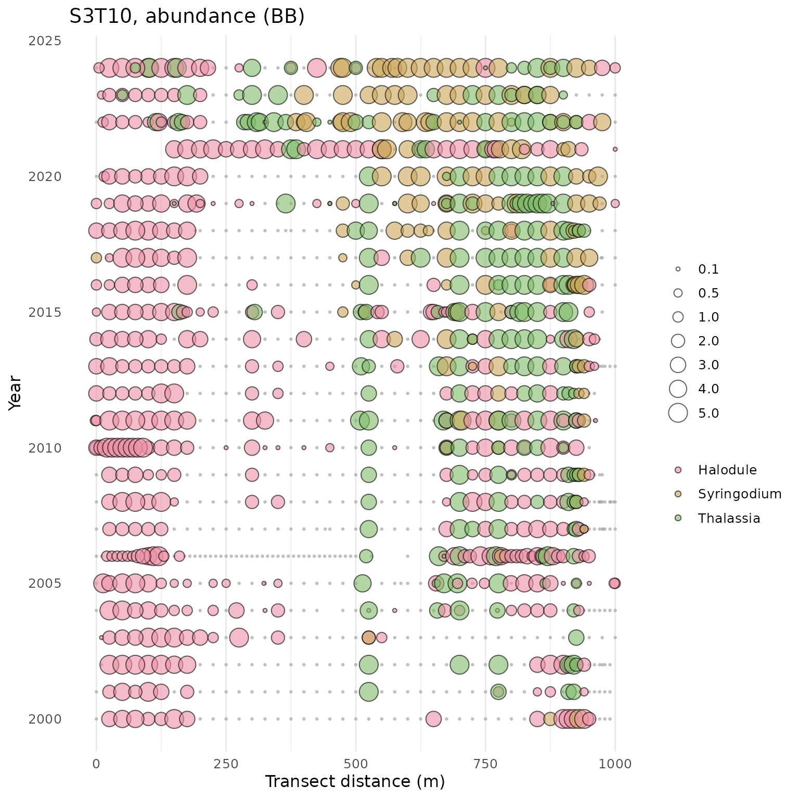
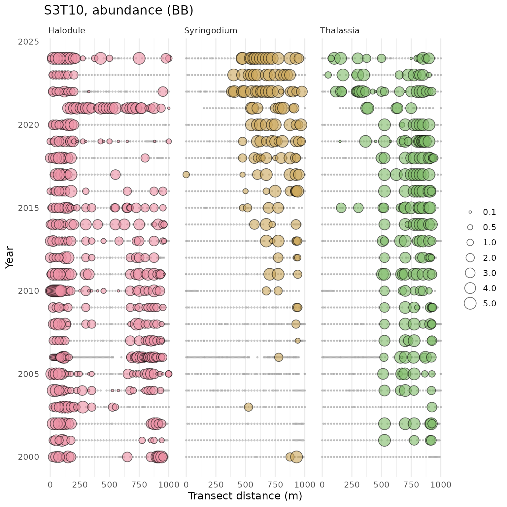
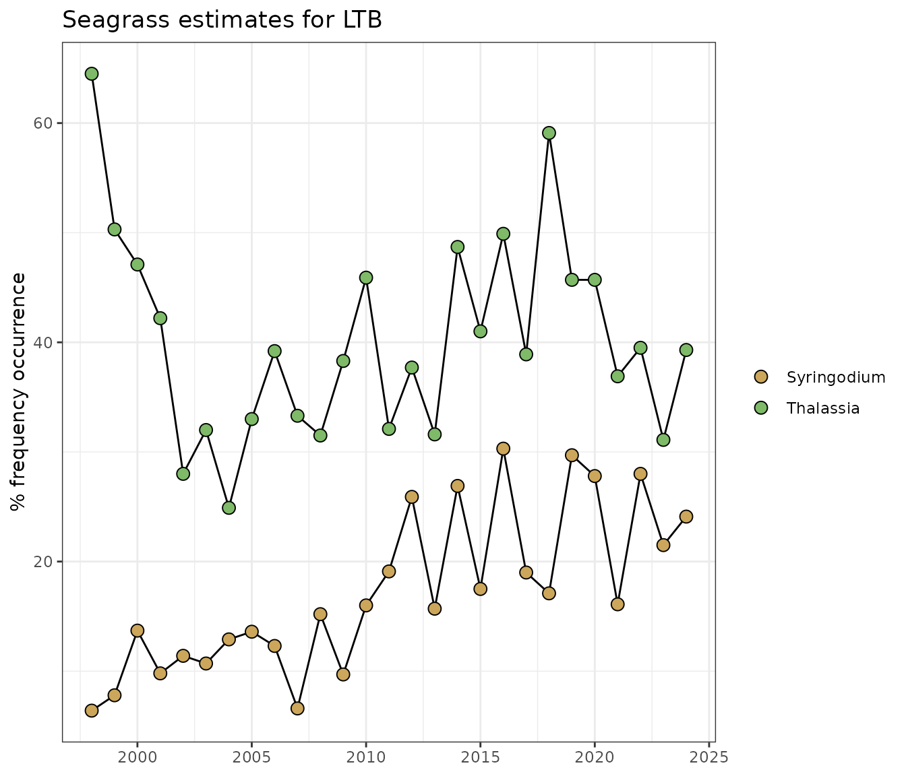

# Seagrass Transect Data

Each year, TBEP partners collect seagrass transect data at fixed
locations in Tampa Bay. Data have been collected since the mid 1990s and
are hosted online at the [Tampa Bay Water
Atlas](https://www.tampabay.wateratlas.usf.edu/) by the University of
South Florida Water Institute. Functions are available in tbeptools for
downloading, analyzing, and plotting these data.

### Data import and included datasets

There are two datasets included in tbeptools that show the actively
monitored transect locations in Tampa Bay. The `trnpts` dataset is a
point object for the starting location of each transect and the `trnlns`
dataset is a line object showing the approximate direction and length of
each transect beginning at each point in `trnpts`. Each dataset also
includes the `MonAgency` column that indicates which monitoring agency
collects the data at each transect.

``` r
trnpts
#> Simple feature collection with 66 features and 11 fields
#> Geometry type: POINT
#> Dimension:     XY
#> Bounding box:  xmin: -82.8089 ymin: 27.49925 xmax: -82.39305 ymax: 28.0001
#> Geodetic CRS:  WGS 84
#> First 10 features:
#>    SEGMENT TRANSECT TRAN_ID Metermark    ID   LAT_DD   LONG_DD MonAgency STATUS
#> 1        1        1    S1T1         0 START 27.99498 -82.68325     EPCHC ACTIVE
#> 2        1        3    S1T3         0 START 28.00010 -82.66417     EPCHC ACTIVE
#> 3        1        5    S1T5         0 START 27.95788 -82.54663      FDEP ACTIVE
#> 4        1        6    S1T6         0 START 27.91348 -82.53282     EPCHC ACTIVE
#> 5        1        8    S1T8         0 START 27.86233 -82.56867     EPCHC ACTIVE
#> 6        1       13   S1T13         0 START 27.92428 -82.70232     EPCHC ACTIVE
#> 7        1       14   S1T14         0 START 27.85533 -82.59738     EPCHC ACTIVE
#> 8        1       15   S1T15         0 START 27.87408 -82.53098     EPCHC ACTIVE
#> 9        1       16   S1T16         0 START 27.88228 -82.62015     PCDEM ACTIVE
#> 10       1       17   S1T17         0 START 27.90498 -82.64793     PCDEM ACTIVE
#>    Comments bay_segment                   geometry
#> 1      <NA>         OTB POINT (-82.68325 27.99498)
#> 2      <NA>         OTB  POINT (-82.66417 28.0001)
#> 3      <NA>         OTB POINT (-82.54663 27.95788)
#> 4      <NA>         OTB POINT (-82.53282 27.91348)
#> 5      <NA>         OTB POINT (-82.56867 27.86233)
#> 6      <NA>         OTB POINT (-82.70232 27.92428)
#> 7      <NA>         OTB POINT (-82.59738 27.85533)
#> 8      <NA>         OTB POINT (-82.53098 27.87408)
#> 9      <NA>         OTB POINT (-82.62015 27.88228)
#> 10     <NA>         OTB POINT (-82.64793 27.90498)
trnlns
#> Simple feature collection with 66 features and 8 fields
#> Geometry type: LINESTRING
#> Dimension:     XYM
#> Bounding box:  xmin: -82.8118 ymin: 27.49807 xmax: -82.39306 ymax: 28.0001
#> m_range:       mmin: 0 mmax: 2700
#> Geodetic CRS:  WGS 84
#> First 10 features:
#>    OBJECTID  Site Shape_Leng MonAgency ActiveYN Comments     bearing
#> 1         1  S1T1   300.1400     EPCHC      YES     <NA>  116.533756
#> 2         5 S1T13  1102.6182     EPCHC      YES     <NA>   -4.689701
#> 3         6 S1T14   800.4500     EPCHC      YES     <NA>  109.402541
#> 4         7 S1T15   701.0075     EPCHC      YES     <NA>  -85.765142
#> 5         8 S1T16   998.9961     PCDEM      YES     <NA>   13.913960
#> 6         9 S1T17  2698.5773     PCDEM      YES     <NA>  -21.165576
#> 7        10 S1T18   997.5451     EPCHC      YES     <NA> -123.050914
#> 8        12  S1T3   401.5991     EPCHC      YES     <NA> -128.034327
#> 9        14  S1T5   457.5927      FDEP      YES     <NA> -121.861907
#> 10       15  S1T6   398.6606     EPCHC      YES     <NA>  -89.362036
#>    bay_segment                       geometry
#> 1          OTB LINESTRING M (-82.68325 27....
#> 2          OTB LINESTRING M (-82.70232 27....
#> 3          OTB LINESTRING M (-82.59738 27....
#> 4          OTB LINESTRING M (-82.53098 27....
#> 5          OTB LINESTRING M (-82.62015 27....
#> 6          OTB LINESTRING M (-82.64791 27....
#> 7          OTB LINESTRING M (-82.61143 27....
#> 8          OTB LINESTRING M (-82.66417 28....
#> 9          OTB LINESTRING M (-82.54663 27....
#> 10         OTB LINESTRING M (-82.53282 27....
```

The two datasets are `sf()` (simple features) objects and are easily
mapped with `mapview()` to view their locations.

``` r
cols <- c("#E16A86", "#CB7F2F", "#9F9400", "#50A315", "#00AC79", "#00AAB7", "#009ADE", "#A87BE4", "#DA65C3")

mapview(trnpts, zcol = 'MonAgency', lwd = 0, legend = F, homebutton = F, col.regions = cols) + 
  mapview(trnlns, zcol = 'MonAgency', homebutton = F, layer.name = 'Monitoring Agency', lwd = 4, color = cols)
```

The transect data can be downloaded from the Water Atlas using the
[`read_transect()`](https://tbep-tech.github.io/tbeptools/reference/read_transect.md)
function. The only required argument for this function is `training`,
which indicates if you want to download training data or the complete
dataset, i.e., `training = TRUE` or `training = FALSE` (default). In the
former case, a small dataset is downloaded that includes only data
collected during an annual training event. These are primarily used
internally by TBEP staff to assess precision among different training
crews. The data are downloaded as a JSON object and formatted internally
using the
[`read_formtransect()`](https://tbep-tech.github.io/tbeptools/reference/read_formtransect.md)
function. Shoot density is reported as number of shoots per square meter
and is corrected for the quadrat size entered in the raw data. Abundance
is reported as a numeric value from 0 -5 for Braun-Blanquet coverage
estimates and blade length is in cm.

``` r
# import training data
traindat <- read_transect(training = TRUE)

# view the data
traindat
#> # A tibble: 1,857 × 11
#>       yr grp   grpact    Crew  MonitoringAgency Site  Depth Species var   aveval
#>    <int> <chr> <chr>     <chr> <chr>            <chr> <int> <chr>   <chr>  <dbl>
#>  1  2020 A     2020: MC… K. H… MCNRD            1       -50 Halodu… Abun…    3  
#>  2  2020 A     2020: MC… K. H… MCNRD            1       -50 Halodu… Blad…    0  
#>  3  2020 A     2020: MC… K. H… MCNRD            1       -50 Halodu… Shor…    0  
#>  4  2020 A     2020: MC… K. H… MCNRD            2       -40 No Cov… Abun…    0  
#>  5  2020 A     2020: MC… K. H… MCNRD            2       -40 No Cov… Blad…    0  
#>  6  2020 A     2020: MC… K. H… MCNRD            2       -40 No Cov… Shor…    0  
#>  7  2020 A     2020: MC… K. H… MCNRD            3       -60 Halodu… Abun…    5  
#>  8  2020 A     2020: MC… K. H… MCNRD            3       -60 Halodu… Blad…   22  
#>  9  2020 A     2020: MC… K. H… MCNRD            3       -60 Halodu… Shor…   27.3
#> 10  2020 A     2020: MC… K. H… MCNRD            3       -60 Thalas… Abun…    1  
#> # ℹ 1,847 more rows
#> # ℹ 1 more variable: sdval <dbl>
```

Change the `training` argument to `FALSE` to download the entire
transect database. This may take a few seconds.

``` r
# import entire transct dataset as JSON
transect <- read_transect(training = FALSE)

# view the data
transect
#> # A tibble: 164,724 × 11
#>    Crew              MonitoringAgency Date       Transect Site  Depth Savspecies
#>    <chr>             <chr>            <date>     <chr>    <chr> <int> <chr>     
#>  1 A. McClory, A. I… MCNRD            2024-08-13 S4T2     0       -10 No Cover  
#>  2 A. McClory, A. I… MCNRD            2024-08-13 S4T2     0       -10 No Cover  
#>  3 A. McClory, A. I… MCNRD            2024-08-13 S4T2     0       -10 No Cover  
#>  4 A. McClory, A. I… MCNRD            2024-08-13 S4T2     100     -40 Thalassia 
#>  5 A. McClory, A. I… MCNRD            2024-08-13 S4T2     100     -40 Thalassia 
#>  6 A. McClory, A. I… MCNRD            2024-08-13 S4T2     100     -40 Thalassia 
#>  7 A. McClory, A. I… MCNRD            2024-08-13 S4T2     125     -25 Thalassia 
#>  8 A. McClory, A. I… MCNRD            2024-08-13 S4T2     125     -25 Thalassia 
#>  9 A. McClory, A. I… MCNRD            2024-08-13 S4T2     125     -25 Thalassia 
#> 10 A. McClory, A. I… MCNRD            2024-08-13 S4T2     150      -5 Halodule  
#> # ℹ 164,714 more rows
#> # ℹ 4 more variables: SeagrassEdge <dbl>, var <chr>, aveval <dbl>, sdval <dbl>
```

The columns in the complete transect database describe the crew
(`Crew`), the monitoring agency (`MonitoringAgency`), sample date
(`Date`), transect name (`Transect`), the meter location for the quadrat
along the transect (`Site`, m), depth at the site (`Depth`, cm),
Seagrass species (`Savspecies`), distance of the seagrass edge on the
transect (`SeagrassEdge`, m), the seagrass variable (`var`), average
value of the variable (`aveval`), and standard deviation of the variable
if appropriate (`sdval`).

If the raw, unformatted transect data are preferred, use the
`raw = TRUE` argument for
[`read_transect()`](https://tbep-tech.github.io/tbeptools/reference/read_transect.md).

``` r
# raw transect data
transectraw <- read_transect(training = FALSE, raw = TRUE)

# view the data
transectraw
#> # A tibble: 55,224 × 46
#>    IDall AssessmentYear CreatedAt   Crew  CountingTech SeagrassEdge Secchi Sonde
#>    <int>          <int> <chr>       <chr> <chr>               <dbl>  <dbl> <lgl>
#>  1     2           1998 1998-10-15… NA    NA                     NA     NA FALSE
#>  2     2           1998 1998-10-15… NA    NA                     NA     NA FALSE
#>  3     2           1998 1998-10-15… NA    NA                     NA     NA FALSE
#>  4     2           1998 1998-10-15… NA    NA                     NA     NA FALSE
#>  5     2           1998 1998-10-15… NA    NA                     NA     NA FALSE
#>  6     2           1998 1998-10-15… NA    NA                     NA     NA FALSE
#>  7     2           1998 1998-10-15… NA    NA                     NA     NA FALSE
#>  8     2           1998 1998-10-15… NA    NA                     NA     NA FALSE
#>  9     2           1998 1998-10-15… NA    NA                     NA     NA FALSE
#> 10     2           1998 1998-10-15… NA    NA                     NA     NA FALSE
#> # ℹ 55,214 more rows
#> # ℹ 38 more variables: Weather <chr>, Hidden <lgl>, HiddenReason <lgl>,
#> #   IsComplete <lgl>, QASubmittedAt <chr>, ReadyForQA <lgl>,
#> #   QACompletedAt <chr>, MonitoringAgency <chr>, Transect <chr>,
#> #   BaySegment <chr>, ID <int>, ObservationDate <chr>, Site <int>,
#> #   Species <chr>, SpeciesAbundance <chr>, Appearance <chr>,
#> #   BladeLength_1 <int>, BladeLength_2 <int>, BladeLength_3 <int>, …
```

### Calculating seagrass frequency occurrence

The rest of the seagrass functions in tbeptools were developed to work
with the complete database. Only the `show_complot()` function (see
below) was developed for the training data. The rest of the functions
can be used to estimate and plot frequency occurrence data.

The
[`anlz_transectocc()`](https://tbep-tech.github.io/tbeptools/reference/anlz_transectocc.md)
function summarizes frequency occurrence for all transects and dates by
collapsing species results across quadrats within each transect.
Abundance and frequency occurrence are estimated as in Sherwood et
al. 2017, equations 1 and 2 \[1\]. In short, frequency occurrence is
estimated as the number of instances a species was observed along a
transect divided by the number of placements along a transect and
average abundance was estimated as the sum of species-specific
Braun-Blanquet scores divided by the number of placements along a
transect. The estimates are obtained for all seagrass species, including
Caulerpa spp. (attached macroalgae), Dapis (cyanobacteria), and
Chaetomorpha (drift green algae), whereas all attached and drift algae
species are aggregated. Drift or attached macroalgae and cyanobacteria
(Dapis) estimates may not be accurate prior to 2021.

``` r
transectocc <- anlz_transectocc(transect)
transectocc
#> # A tibble: 41,916 × 6
#> # Groups:   Date, Transect [1,497]
#>    Date       Transect Savspecies                  nsites foest bbest
#>    <date>     <chr>    <chr>                        <int> <dbl> <dbl>
#>  1 1997-10-11 S2T3     "AA"                            41     0     0
#>  2 1997-10-11 S2T3     "Caulerpa"                      41     0     0
#>  3 1997-10-11 S2T3     "Chaetomorpha"                  41     0     0
#>  4 1997-10-11 S2T3     "DA"                            41     0     0
#>  5 1997-10-11 S2T3     "DB: Dictyota\r\n"              41     0     0
#>  6 1997-10-11 S2T3     "DB: Drift Brown\r\n"           41     0     0
#>  7 1997-10-11 S2T3     "DG: Drift Green"               41     0     0
#>  8 1997-10-11 S2T3     "DG: Ulva"                      41     0     0
#>  9 1997-10-11 S2T3     "DG: Ulva fasciata\r\n"         41     0     0
#> 10 1997-10-11 S2T3     "DG: Ulva intestinales\r\n"     41     0     0
#> # ℹ 41,906 more rows
```

The second function,
[`anlz_transectave()`](https://tbep-tech.github.io/tbeptools/reference/anlz_transectave.md),
takes the results from
[`anlz_transectocc()`](https://tbep-tech.github.io/tbeptools/reference/anlz_transectocc.md)
and estimates annual results across major bay segments for all seagrass
species by averaging frequency occurrence across transects. This
function is used internally within the
[`show_transectmatrix()`](https://tbep-tech.github.io/tbeptools/reference/show_transectmatrix.md)
function to create summary plots. The frequency occurrence estimates are
also binned into categories for simple trend assessments, e.g., red \<
25%, orange 25-50%, yellow 50-75%, and green \> 75%. Results for
specific bay segments and annual ranges can be filtered with the
`bay_segment` and `yrrng` arguments.

``` r
transectave <- anlz_transectave(transectocc)
transectave
#> # A tibble: 168 × 4
#> # Groups:   bay_segment [6]
#>    bay_segment    yr foest focat  
#>    <fct>       <dbl> <dbl> <fct>  
#>  1 All          1998  58.0 #E9C318
#>  2 OTB          1998  65.5 #E9C318
#>  3 HB           1998  15.0 #CC3231
#>  4 MTB          1998  53.7 #E9C318
#>  5 LTB          1998  80.8 #2DC938
#>  6 BCB          1998  81.0 #2DC938
#>  7 All          1999  51.4 #E9C318
#>  8 OTB          1999  64.7 #E9C318
#>  9 HB           1999  10.1 #CC3231
#> 10 MTB          1999  51.8 #E9C318
#> # ℹ 158 more rows
```

The third function,
[`anlz_transectavespp()`](https://tbep-tech.github.io/tbeptools/reference/anlz_transectavespp.md),
takes the results from
[`anlz_transectocc()`](https://tbep-tech.github.io/tbeptools/reference/anlz_transectocc.md)
and estimates annual averages across major bay segments as in the last
function, but results are retained for individual species. This function
is used internally within the
[`show_transectavespp()`](https://tbep-tech.github.io/tbeptools/reference/show_transectavespp.md)
function to create summary plots. All summaries are aggregated across
the selected bay segments, i.e., the default is to average by
species/year across all segments. Results for an individual bay segment
can be returned with the appropriate argument, e.g., by using
`bay_segment = 'OTB'` to select only Old Tampa Bay. Results can also be
filtered by specific species using the `species` argument, where the
default is to return all. *Caulerpa spp.*, *Dapis spp.*, and
*Chaetomorpha spp.* are also included.

``` r
transectavespp <- anlz_transectavespp(transectocc)
transectavespp
#> # A tibble: 252 × 3
#>       yr Savspecies    foest
#>    <dbl> <fct>         <dbl>
#>  1  1998 Caulerpa     0.0166
#>  2  1998 Chaetomorpha 0     
#>  3  1998 Dapis        0     
#>  4  1998 Halodule     0.361 
#>  5  1998 Halophila    0     
#>  6  1998 Ruppia       0.0112
#>  7  1998 Syringodium  0.0451
#>  8  1998 Thalassia    0.254 
#>  9  1998 total        0.580 
#> 10  1999 Caulerpa     0.0283
#> # ℹ 242 more rows
```

Results for individual bay segments from
[`anlz_transectavespp()`](https://tbep-tech.github.io/tbeptools/reference/anlz_transectavespp.md)
can be retained by setting the `by_seg` argument to `TRUE`. Note that
totals are not returned in this case.

``` r
transectavespp <- anlz_transectavespp(transectocc, by_seg = TRUE)
transectavespp
#> # A tibble: 1,400 × 5
#>       yr bay_segment Savspecies   foest nsites
#>    <dbl> <fct>       <fct>        <dbl>  <int>
#>  1  1998 BCB         Caulerpa     0         96
#>  2  1998 BCB         Chaetomorpha 0         96
#>  3  1998 BCB         Dapis        0         96
#>  4  1998 BCB         Halodule     0.613     96
#>  5  1998 BCB         Halophila    0         96
#>  6  1998 BCB         No Cover     0.190     96
#>  7  1998 BCB         Ruppia       0         96
#>  8  1998 BCB         Syringodium  0         96
#>  9  1998 BCB         Thalassia    0.304     96
#> 10  1998 BCB         total        0.810     96
#> # ℹ 1,390 more rows
```

### Plotting results

There is one plotting function for the training data. The
[`show_compplot()`](https://tbep-tech.github.io/tbeptools/reference/show_compplot.md)
function is used to compare training data between crews for a selected
species (`species` argument) and variable (`varplo` argument).

``` r
show_compplot(traindat, yr = 2025, site = '3', species = 'Halodule', varplo = 'Abundance', base_size = 14)
```


The rest of the plotting functions work with the complete transect data.
Data for an individual transect can be viewed with the
[`show_transect()`](https://tbep-tech.github.io/tbeptools/reference/show_transect.md)
function by entering the transect (site) number, species (one to many),
and variable to plot. The plot shows relative values for the selected
species and variable by distance along the transect (x-axis) and year of
sampling (y-axis). The plots provide an overall summary of temporal and
spatial changes in the selected seagrass metric for an individual
location.

``` r
show_transect(transect, site = 'S3T10', species = 'Halodule', varplo = 'Abundance')
```


The plot can also be produced as a [plotly](https://plotly.com/r/)
interactive plot by setting `plotly = TRUE` inside the function. Note
that the size legend is merged with the species legend, where the point
size is the average abundance for the species. The sizes can be viewed
on mouseover of each point.

``` r
show_transect(transect, site = 'S3T10', species = 'Halodule', varplo = 'Abundance', plotly = T)
```

The
[`show_transect()`](https://tbep-tech.github.io/tbeptools/reference/show_transect.md)
function can also be used to plot multiple species. One to many species
can be provided to the `species` argument.

``` r
show_transect(transect, site = 'S3T10', species = c('Halodule', 'Syringodium', 'Thalassia'), varplo = 'Abundance')
```



The plots can also be separated into facets for each species using
`facet = TRUE`. This is useful to reduce overplotting of multiple
species found at the same location.

``` r
show_transect(transect, site = 'S3T10', species = c('Halodule', 'Syringodium', 'Thalassia'), varplo = 'Abundance', facet = TRUE)
```



The
[`show_transectsum()`](https://tbep-tech.github.io/tbeptools/reference/show_transectsum.md)
function provides an alternative summary of data at an individual
transect. This plot provides a quick visual assessment of how frequency
occurrence or abundance for multiple species has changed over time at a
selected transect. Unlike
[`show_transect()`](https://tbep-tech.github.io/tbeptools/reference/show_transect.md),
the plot shows aggregated results across quadrats along the transect and
uses summarized data from the
[`anlz_transectocc()`](https://tbep-tech.github.io/tbeptools/reference/anlz_transectocc.md)
function as input.

``` r
show_transectsum(transectocc, site = 'S3T10')
```

A summary matrix of frequency occurrence estimates across all species
can be plotted with
[`show_transectmatrix()`](https://tbep-tech.github.io/tbeptools/reference/show_transectmatrix.md).
This uses results from the
[`anlz_transectocc()`](https://tbep-tech.github.io/tbeptools/reference/anlz_transectocc.md)
and
[`anlz_transectave()`](https://tbep-tech.github.io/tbeptools/reference/anlz_transectave.md)
functions to estimate annual averages by bay segment. The continuous
frequency occurrence estimates are binned into color categories
described above, as in Table 1 in \[2\].

``` r
show_transectmatrix(transectocc)
```


The default color scheme is based on arbitrary breaks at 25, 50, and 75
percent frequency occurrence. These don’t necessarily translate to any
ecological breakpoints. Use `neutral = TRUE` to use a neutral and
continuous color palette.

``` r
show_transectmatrix(transectocc, neutral = T)
```


The matrix can also be produced as a [plotly](https://plotly.com/r/)
interactive plot by setting `plotly = TRUE` inside the function.

``` r
show_transectmatrix(transectocc, plotly = T)
```

Time series plots of annual averages of frequency occurrence estimates
by each species can be shown with the
[`show_transectavespp()`](https://tbep-tech.github.io/tbeptools/reference/show_transectavespp.md)
function. By default, all estimates are averaged across all bay segments
for each species. The plot is a representation of Figure 2 in \[2\].

``` r
show_transectavespp(transectocc)
```


Results for individual segments and species can be returned with the
`bay_segment` and `species` arguments. Use the argument `total = FALSE`
to omit the total frequency occurrence from the plot.

``` r
show_transectavespp(transectocc, bay_segment = 'LTB', species = c('Syringodium', 'Thalassia'), total = FALSE)
```



The plot can also be produced as a [plotly](https://plotly.com/r/)
interactive plot by setting `plotly = TRUE` inside the function.

``` r
show_transectavespp(transectocc, bay_segment = 'LTB', species = c('Syringodium', 'Thalassia'), plotly = T)
```

As an alternative to plotting the species averages over time with
[`show_transectavespp()`](https://tbep-tech.github.io/tbeptools/reference/show_transectavespp.md),
a table can be created by setting `asreact = TRUE`. Filtering options
that apply to the plot also apply to the table, e.g., filtering by the
four major bay segments and specific year ranges. Also note that the
totals are not returned in the table.

``` r
show_transectavespp(transectocc, asreact = T, bay_segment = c('HB', 'OTB', 'MTB', 'LTB'), yrrng = c(2006, 2012))
```

All of the above describes methods in tbeptools for working with
transect monitoring data. Seagrass coverage maps are also created
approximately biennially by the Southwest Florida Water Management
District, available at <https://data-swfwmd.opendata.arcgis.com/>. The
`seagrass` data object included with the package shows Tampa Bay
coverage total for each year of available data, including a 1950s
reference estimate. The
[`show_seagrasscoverage()`](https://tbep-tech.github.io/tbeptools/reference/show_seagrasscoverage.md)
function creates the flagship seagrass coverage graphic to report on
changes over time from these data.

``` r
show_seagrasscoverage(seagrass)
```


## References

\[1\]

E. Sherwood, H. Greening, J.O.R. Johansson, K. Kaufman, G. Raulerson,
Tampa Bay (Florida, USA): Documenting Seagrass Recovery since the 1980’s
and Reviewing the Benefits, Southeastern Geographer 57 (2017) 294–319.
https://doi.org/[10.1353/sgo.2017.0026](https://doi.org/10.1353/sgo.2017.0026).

\[2\]

R. Johansson, Seagrass Transect Monitoring in Tampa Bay: A Summary of
Findings from 1997 through 2015, Tampa Bay Estuary Program, St.
Petersburg, Florida, 2016.
<https://drive.google.com/file/d/1Z_8L9sYQWSl1hon1tP1Y8zBo7MHQK9zC/view?usp=drivesdk>.
