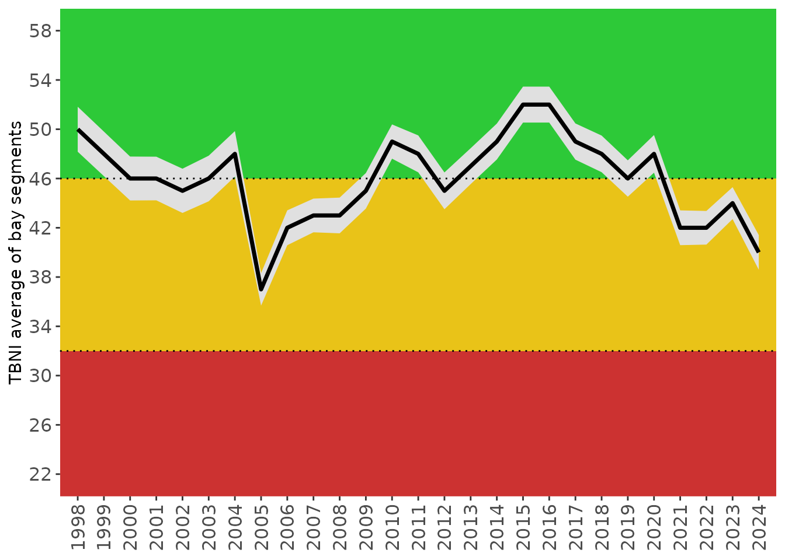

# Tampa Bay Nekton Index

### Background

The Tampa Bay Nekton Index (TBNI) \[1,2\]) is a multimetric assessment
method that quantifies the ecological health of the nekton community in
Tampa Bay. The index provides a complementary approach to evaluating
environmental condition that is supported by other assessment methods
currently available for Tampa Bay (e.g., water quality report card,
Benthic index, etc.). The tbeptools package includes several functions
described below to import data required for the index, analyze the data
to calculate metrics and index scores, and plot the results to view
trends over time. Each of the functions are described in detail below.

The TBNI uses catch data from the Florida Fish and Wildlife Conservation
Commission (FWC) Fish and Wildlife Research Institute’s (FWRI)
[Fisheries-Independent Monitoring (FIM)
program](https://myfwc.com/research/saltwater/reef-fish/monitoring/fim-stratified-random-sampling/).
Catch results from a center-bag seine have the longest and most
consistent record in the FIM database and were used to develop the TBNI.
These include counts and taxa identification for individuals caught in
near shore areas, generally as early recruits, juveniles, and
smaller-bodied nekton. All fish and selected invertebrates are
identified to the lowest possible taxon (usually species), counted, and
a subset are measured. Current protocols were established in 1998 and
TBNI estimates are unavailable prior to this date.

### Data import and included datasets

Data required for calculating TBNI scores can be imported into the
current R session using the
[`read_importfim()`](https://tbep-tech.github.io/tbeptools/reference/read_importfim.md)
function. This function downloads the latest FIM file from an FTP site
if the data have not already been downloaded to the location specified
by the input arguments.

To download the data, first create a character path for the location of
the file. If one does not exist, specify a desired location and name for
the downloaded file. Here, we want to put the file on the desktop in our
home directory and name it `fimdata.csv`.

``` r
csv <- '~/Desktop/fimdata.csv'
fimdata <- read_importfim(csv)
```

Running the above code will return the following error:

``` r
#> Error in read_importfim(csv) : file.exists(csv) is not TRUE
```

We get an error message from the function indicating that the file is
not found. This makes sense because the file doesn’t exist yet, so we
need to tell the function to download the latest file. This is done by
changing the `download_latest` argument to `TRUE` (the default is
`FALSE`).

``` r
fimdata <- read_importfim(csv, download_latest = T)
```

``` r
#> File ~/Desktop/fimdata.csv does not exist, replacing with downloaded file...
```

Now we get an indication that the file on the server is being
downloaded. When the download is complete, we’ll have the data
downloaded and saved to the `fimdata` object in the current R session.

If we try to run the function again after downloading the data from the
server, we get the following message. This check is done to make sure
that the data are not unnecessarily downloaded if the current matches
the file on the server.

``` r
fimdata <- read_importfim(csv, download_latest = T)
```

``` r
#> File is current..
```

Every time that tbeptools is used to work with the FIM data,
[`read_importfim()`](https://tbep-tech.github.io/tbeptools/reference/read_importfim.md)
should be used to import the data. You will always receive the message
`File is current...` if your local file matches the one on the server.
However, new data are regularly collected and posted on the server. If
`download_latest = TRUE` and your local file is out of date, you will
receive the following message:

``` r
#> Replacing local file with current...
```

After the data are successfully imported, you can view them from the
assigned object:

``` r
head(fimdata)
#> # A tibble: 6 × 19
#>   Reference    Sampling_Date Latitude Longitude Zone   Grid NODCCODE  Year Month
#>   <chr>        <date>           <dbl>     <dbl> <chr> <int> <chr>    <dbl> <dbl>
#> 1 TBM19980109… 1998-01-09        28.0     -82.7 A        31 8747020…  1998     1
#> 2 TBM19980109… 1998-01-09        28.0     -82.7 A        31 8805030…  1998     1
#> 3 TBM19980109… 1998-01-09        27.9     -82.7 A        62 6177010…  1998     1
#> 4 TBM19980109… 1998-01-09        27.9     -82.7 A        63 9998000…  1998     1
#> 5 TBM19980109… 1998-01-09        27.9     -82.6 A        65 8820020…  1998     1
#> 6 TBM19980109… 1998-01-09        27.9     -82.6 A        65 8826020…  1998     1
#> # ℹ 10 more variables: Total_N <dbl>, ScientificName <chr>,
#> #   Include_TB_Index <chr>, Hab_Cat <chr>, Est_Cat <chr>, Est_Use <chr>,
#> #   Feeding_Cat <chr>, Feeding_Guild <chr>, Selected_Taxa <chr>,
#> #   bay_segment <chr>
```

The imported data are formatted for calculating the TBNI. The columns
include a `Reference` for the FIM sampling site, the sampling date,
sampling `Zone`, sampling `Grid`, `NODCCODE` as a unique identifier for
species, sample year, sample month, total catch as `Total_N`, scientific
name, a column indicating if the species is included in the index, and
several columns indicating species-specific information required for the
metrics. For the final columns, a separate lookup table is provided in
the package that is merged with the imported FIM data. This file,
`tbnispp`, can be viewed anytime the package is loaded:

``` r
head(tbnispp)
#>      TSN   NODCCODE               ScientificName Include_TB_Index Hab_Cat
#> 1 173245 8860030201 Acanthostracion quadricornis                Y       B
#> 2 172986 8858030202             Achirus lineatus                Y       B
#> 3 160978 8713070101           Aetobatus narinari                Y       B
#> 4 161121 8739010101                Albula vulpes                Y       P
#> 5  96600 6179140000               Alpheidae spp.                N       B
#> 6 173131 8860020101           Aluterus schoepfii                Y       B
#>   Est_Cat Est_Use Feeding_Cat Feeding_Guild Selected_Taxa
#> 1      MS       O          TS            ZB             N
#> 2      ES       O          TS            ZB             N
#> 3      MS       F          TS            ZB             N
#> 4      MS       S          TS            ZB             Y
#> 5                          DV            DV             N
#> 6      MS       F          TS            HV             N
```

The
[`read_importfim()`](https://tbep-tech.github.io/tbeptools/reference/read_importfim.md)
function can also return a simple features object of sampled stations in
the raw FIM data by setting . These data are matched to the appropriate
bay segments for tabulating TBNI scores. The resulting dataset indicates
where sampling has occurred and can be mapped with the `mapview()`
function. For ease of use, a dataset named `fimstations` is included in
tbeptools.

``` r
fimstations <- read_importfim(csv, download_latest = TRUE, locs = TRUE)
mapview(fimstations, zcol = 'bay_segment')
```

The
[`read_importfim()`](https://tbep-tech.github.io/tbeptools/reference/read_importfim.md)
function processes the observed data as needed for the TBNI, including
merging the rows with the `tbnispp` and `fimstations` data. Once
imported, the metrics and scores can be calculated.

### Calculating metrics and TBNI scores

Metrics and scores for the Tampa Bay Nekton Index can be calculated
using two functions. The
[`anlz_tbnimet()`](https://tbep-tech.github.io/tbeptools/reference/anlz_tbnimet.md)
function calculates all raw metrics and the
[`anlz_tbniscr()`](https://tbep-tech.github.io/tbeptools/reference/anlz_tbniscr.md)
function calculates scored metrics and the final TBNI score. Both
functions use the imported and formatted FIM data as input.

The TBNI includes five metrics that were sensitive to stressor gradients
and provide unique information about Nekton community response to
environmental conditions. The metrics include:

- `NumTaxa`: Species richness

- `BenthicTaxa`: Species richness for benthic taxa

- `TaxaSelect`: Number of “selected” species (i.e., commercially and/or
  recreationally important)

- `NumGuilds`: Number of trophic guilds

- `Shannon`: Shannon Diversity (H)

Raw metrics are first calculated from the observed data and then scaled
to a standard score from 0 - 10 by accounting for expected relationships
to environmental gradients and 5th/95th percentiles of the
distributions. The final TBNI score is the summed average of the scores
ranging from 0 - 100.

The raw metrics, scored metrics, and final TBNI score is returned with
the
[`anlz_tbniscr()`](https://tbep-tech.github.io/tbeptools/reference/anlz_tbniscr.md)
function.

``` r
tbniscr <- anlz_tbniscr(fimdata)
head(tbniscr)
#> # A tibble: 6 × 16
#>   Reference      Year Month Season bay_segment TBNI_Score NumTaxa ScoreNumTaxa
#>   <chr>         <dbl> <dbl> <chr>  <chr>            <dbl>   <dbl>        <dbl>
#> 1 TBM1998010906  1998     1 Winter OTB                 18       2            2
#> 2 TBM1998010910  1998     1 Winter OTB                 14       1            1
#> 3 TBM1998010912  1998     1 Winter OTB                  0       0            0
#> 4 TBM1998010914  1998     1 Winter OTB                 20       2            2
#> 5 TBM1998010915  1998     1 Winter MTB                 46       4            4
#> 6 TBM1998010917  1998     1 Winter MTB                 24       2            2
#> # ℹ 8 more variables: BenthicTaxa <dbl>, ScoreBenthicTaxa <dbl>,
#> #   TaxaSelect <dbl>, ScoreTaxaSelect <dbl>, NumGuilds <dbl>,
#> #   ScoreNumGuilds <dbl>, Shannon <dbl>, ScoreShannon <dbl>
```

The five metrics chosen for the TBNI were appropriate for the Tampa Bay
dataset and were selected from a larger pool of candidate metrics. All
potential metrics can be calculated using the
[`anlz_tbnimet()`](https://tbep-tech.github.io/tbeptools/reference/anlz_tbnimet.md)
function. These metrics can be used in standalone assessments or for
developing a Nekton index outside of Tampa Bay. The argument
`all = TRUE` must be used to return all metrics, otherwise only the
selected five for the TBNI are returned.

``` r
tbnimet <- anlz_tbnimet(fimdata, all = T)
head(tbnimet)
#> # A tibble: 6 × 37
#>   Reference      Year Month Season bay_segment NumTaxa NumIndiv Shannon Simpson
#>   <chr>         <dbl> <dbl> <chr>  <chr>         <dbl>    <dbl>   <dbl>   <dbl>
#> 1 TBM1998010906  1998     1 Winter OTB               2       17   0.362    1.26
#> 2 TBM1998010910  1998     1 Winter OTB               1        1   0        1   
#> 3 TBM1998010912  1998     1 Winter OTB               0        0   0        0   
#> 4 TBM1998010914  1998     1 Winter OTB               2        2   0.693    2   
#> 5 TBM1998010915  1998     1 Winter MTB               4       11   1.16     2.81
#> 6 TBM1998010917  1998     1 Winter MTB               2        5   0.500    1.47
#> # ℹ 28 more variables: Pielou <dbl>, TaxaSelect <dbl>, NumGuilds <dbl>,
#> #   TSTaxa <dbl>, TGTaxa <dbl>, BenthicTaxa <dbl>, PelagicTaxa <dbl>,
#> #   OblTaxa <dbl>, MSTaxa <dbl>, ESTaxa <dbl>, SelectIndiv <dbl>, Taxa90 <dbl>,
#> #   TSAbund <dbl>, TGAbund <dbl>, BenthicAbund <dbl>, PelagicAbund <dbl>,
#> #   OblAbund <dbl>, ESAbund <dbl>, MSAbund <dbl>, Num_LR <dbl>, PropTG <dbl>,
#> #   PropTS <dbl>, PropBenthic <dbl>, PropPelagic <dbl>, PropObl <dbl>,
#> #   PropMS <dbl>, PropES <dbl>, PropSelect <dbl>
```

### Plotting results

The TBNI scores can be viewed as annual averages using the
[`show_tbniscr()`](https://tbep-tech.github.io/tbeptools/reference/show_tbniscr.md),
[`show_tbniscrall()`](https://tbep-tech.github.io/tbeptools/reference/show_tbniscrall.md)
and
[`show_tbnimatrix()`](https://tbep-tech.github.io/tbeptools/reference/show_tbnimatrix.md)
functions. The
[`show_tbniscr()`](https://tbep-tech.github.io/tbeptools/reference/show_tbniscr.md)
creates a line graph of values over time for each bay segment, whereas
the
[`show_tbniscrall()`](https://tbep-tech.github.io/tbeptools/reference/show_tbniscrall.md)
function plots an overall average across bay segments over time. The
[`show_tbnimatrix()`](https://tbep-tech.github.io/tbeptools/reference/show_tbnimatrix.md)
plots the annual bay segment averages as categorical values in a
conventional “stoplight” graphic. The input to each function is the
output from the
[`anlz_tbniscr()`](https://tbep-tech.github.io/tbeptools/reference/anlz_tbniscr.md)
function.

``` r
show_tbniscr(tbniscr)
```


``` r
show_tbniscrall(tbniscr)
```



``` r
show_tbnimatrix(tbniscr)
```


Each of the plots can also be produced as
[plotly](https://plotly.com/r/) interactive plots by setting
`plotly = TRUE` inside each function.

``` r
show_tbniscr(tbniscr, plotly = T)
```

``` r
show_tbniscrall(tbniscr, plotly = T)
```

``` r
show_tbnimatrix(tbniscr, plotly = T)
```

The breakpoints for the categorical outcomes of the TBNI scores shown by
the colors in each graph are based on the 33rd and 50th percentiles of
the distribution of all TBNI scores calculated for Tampa Bay. This
plotting option is provided for consistency with existing TBEP reporting
tools, e.g., the [water quality report
card](https://tbep-tech.github.io/wq-static/wq.pdf) returned by
[`show_matrix()`](https://tbep-tech.github.io/tbeptools/reference/show_matrix.md).
The categorical outcomes serve as management guidelines each year for
activities to support environmental resources of the Bay: **Stay the
Course**, **Caution**, and **On Alert** \[3\].

The graphs returned by the plotting functions are `ggplot` objects that
can be further modified. They can be combined below using
[patchwork](https://patchwork.data-imaginist.com/) in a single graphic
showing the trends over time as both categorical outcomes in the matrix
and continuous scores in the bottom plot.

``` r
p1 <- show_tbnimatrix(tbniscr, txtsz = NULL, rev = TRUE, position = 'bottom') +
  scale_y_continuous(expand = c(0,0), breaks = c(1998:2020)) +
  coord_flip() +
  theme(axis.text.x = element_blank())

p2 <- show_tbniscr(tbniscr)

p1 + p2 + plot_layout(ncol = 1, heights = c(0.3, 1))
```


## References

\[1\]

M.N. Schrandt, T.C. MacDonald, Tampa Bay Nekton Index, Final Report,
Tampa Bay Estuary Program, St. Petersburg, Florida, 2018.
<https://drive.google.com/file/d/1oWm-xosC-mb9e8GnO4BmtJRNXjfEb4H_/view?usp=drivesdk>.

\[2\]

M.N. Schrandt, T.C. MacDonald, 2018 Multimetric Index of Nekton Health
for Tampa Bay, FL, Tampa Bay Estuary Program, St. Petersburg, Florida,
2019.
<https://drive.google.com/file/d/1EVBUFGcmhvp3Yu1L2YGNQuxY-cqO0zyI/view?usp=drivesdk>.

\[3\]

Janicki Environmental, Inc., Tracking Chlorophyll-a and Light
Attenuation in Tampa Bay: Application to 2004 Data, Tampa Bay Estuary
Program, St. Petersburg, Florida, 2005.
<https://drive.google.com/file/d/1GNSb5i_x_WSxe8VKz9FtqZ7fjWcnVqHO/view?usp=drivesdk>.
