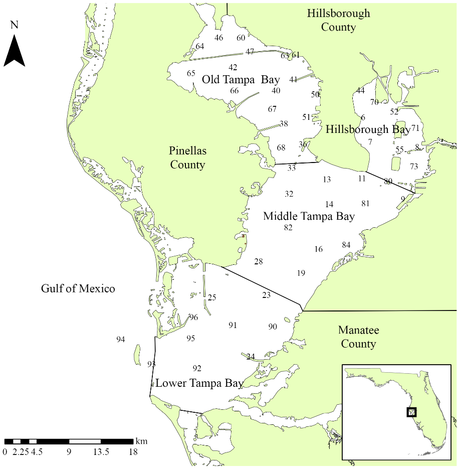

```{r setup, include = FALSE}
knitr::opts_chunk$set(
  collapse = TRUE,
  comment = "#>",
  message = F, warning = F, 
  fig.align = 'center'
)

# libraries
library(tbeptools) 
library(bookdown)
library(ggplot2)
library(dplyr)
library(knitr)
library(sf)

sf_use_s2(FALSE)

# spelling::spell_check_files("vignettes/intro.Rmd")
```

## Background

Dashboard: https://shiny.tbep.org/wq-dash

This vignette provides an overview of the functions in tbeptools that can be used to work with water quality data in Tampa Bay.  View the other vignettes for topical introductions to other reporting products (e.g., seagrasess, tidal creeks, etc.).

The environmental recovery of Tampa Bay is an exceptional success story for coastal water quality management. Nitrogen loads in the mid 1970s have been estimated at 8.2 million kg/yr, with approximately 5.5 million kg/yr entering the upper Bay alone [@Poe05,@Greening06].  Reduced water clarity associated with phytoplankton biomass contributed to a dramatic reduction in the areal coverage of seagrass [@Tomasko05] and development of hypoxic events, causing a decline in benthic faunal production [@Santos80].  Extensive efforts to reduce nutrient loads to the Bay occurred by the late 1970s, with the most notable being improvements in infrastructure for wastewater treatment in 1979.  Improvements in water clarity and decreases in chlorophyll concentrations were observed Bay-wide in the 1980s, with conditions generally remaining constant to present day [@Beck15].

Tracking changes in environmental condition from the past to present day would not have been possible without a long-term monitoring dataset. Data have been collected monthly by the Environmental Protection Commission of Hillsborough County since 1974 [@Sherwood16;@TBEP17].  Samples are taken at forty-five stations by water collection or monitoring sonde at bottom, mid- or surface depths, depending on parameter.  The locations of monitoring stations are fixed and cover the entire Bay from the uppermost mesohaline sections to the lowermost euhaline portions that have direct interaction with the Gulf of Mexico.  Up to 515 observations are available for different parameters at each station, e.g., nitrogen, chlorophyll-a, and secchi depth. 

Data collected from the monitoring program are processed and maintained in a spreadsheet titled `RWMDataSpreadsheet_ThroughCurrentReportMonth.xlsx` at <https://epcbocc.sharepoint.com/:x:/s/Share/EWKgPirIkoxMp9Hm_wVEICsBk6avI9iSRjFiOxX58wXzIQ?e=kAWZXl&download=1> (viewable [here](https://epcbocc.sharepoint.com/:f:/s/Share/EiypSSYdsEFCi84Sv_6-t7kBUYaXiIqN0B1n2w57Z_V3kQ?e=NdZQcU)). These data include observations at all stations and for all parameters throughout the period of record.  To date, there have been no systematic tools for importing, analyzing, and reporting information from these data. The **tbeptools** package provides was developed to address this need.

```{r tbmap, out.width = '80%', echo = F, fig.cap = 'Locations of long-term monitoring stations in Tampa Bay. The Bay is separated into four segments defined by chemical, physical, and geopolitical boundaries.'}

```

## Read

The main function for importing water quality data is `read_importwq()`.  This function downloads the latest file if one is not already available at the location specified by the `xlsx` input argument.

First, create a character path for the location of the file.  If one does not exist, specify a desired location and name for the downloaded file.  Here, we want to put the file in the vignettes folder and name is current_results.xls.  Note that this file path is relative to the root working directly for the current R session.  You can view the working directory with `getwd()`.

```{r}
xlsx <- 'vignettes/current_results.xlsx'
```

Now we pass this `xlsx` object to the `read_importwq()` function. 

```{r, eval = F, error = T}
epcdata <- read_importwq(xlsx)
```

We get an error message from the function indicating that the file is not found. This makes sense because the file doesn't exist yet, so we need to tell the function to download the latest file.  This is done by changing the `download_latest` argument to `TRUE` (the default is `FALSE`). 

```{r, eval = F}
epcdata <- read_importwq(xlsx, download_latest = TRUE)
```
```
#> File vignettes/current_results.xlsx does not exist, replacing with downloaded file...
```
Now we get the same message, but with an indication that the file on the server is being downloaded. We'll have the data downloaded and saved to the `epcdata` object after it finishes downloading. 

If we try to run the function again after downloading the data from the server, we get the following message.  This check is done to make sure that the data are not unnecessarily downloaded if the current file matches the file on the server.

```{r, eval = F}
epcdata <- read_importwq(xlsx, download_latest = TRUE)
```
```
#> File is current...
```

Every time that tbeptools is used to work with the monitoring data, `read_importwq()` should be used to import the data. You will always receive the message `File is current...` if your local file matches the one on the server.  However, new data are regularly collected and posted on the server.  If `download_latest = TRUE` and your local file is out of date, you will receive the following message:

```
#> Replacing local file with current...
```

The argument `na` indicates which fields in the downloaded spreadsheet are treated as blank values and assigned to `NA`. Any number of strings can be added to this function to replace fields with `NA` values.  

After the data are successfully imported, you can view them from the assigned object: 

```{r}
epcdata
```

These data include the bay segment name, station number, sample time, year, month, latitude, longitude, station depth, sample depth, total nitrogen, secchi depth, chlorophyll, salinity, water temperature, turbidity, and water color.  All other parameters can be included by setting `all = TRUE` in `read_importwq()`.

An import function is also available to download and format phytoplankton cell count data.  The `read_importphyto()` function works similarly as the import function for the water quality data.  Start by specifying a path where the data should be downloaded and set `download_latest` to `TRUE`.  This function will download and summarize data from the file `PlanktonDataList_ThroughCurrentReportMonth.xlsx` on the EPC website.

```{r eval = F}
xlsx <- 'phyto_data.xlsx'
phytodata <- read_importphyto(xlsx, download_latest = T)
```
```
#> File vignettes/phyto_data.xlsx does not exist, replacing with downloaded file...
```

After the phytoplankton data are successfully imported, you can view them from the assigned object: 

```{r}
phytodata
```

These data are highly summarized from the raw data file available online.  Cell counts (as number of cells per 0.1mL) for selected taxa are shown by date and quarter (i.e., Jan/Feb/Mar, Apr/May/Jun, etc.) for each station.  The quarter is indicated in the `yrqrt` column specified by the starting date of each quarter (e.g., `1975-07-01` is the quarter Jul/Aug/Sep for 1975).  These data are primarily used to support analyses in the water quality dashboard: <https://shiny.tbep.org/wq-dash/>

### Retrieving additional water quality data

Most of the water quality functions in tbeptools were developed to work with the long-term monitoring data from the Environmental Protection Commission of Hillsborough County.  Additional monitoring programs in Tampa Bay can also be used to develop a more complete description of water quality.  

The `read_importwqp()` function can be used to retrieve data from the USEPA Water Quality Portal for data from monitoring organizations in and around the Tampa Bay watershed.  The function retrieves nutrient, chlorophyll, secchi, temperature, salinity, and turbidity data for all available estuarine stations monitored by each organization if `type = 'wq'`.  The data can be retrieved as follows and will typically take less than one minute to download. 

```{r, eval=FALSE}
# get Manatee County data
mancodata <- read_importwqp(org = '21FLMANA_WQX', type = 'wq', trace = T)

# get Pinellas County data
pincodata <- read_importwqp(org = '21FLPDEM_WQX', type = 'wq', trace = T)
```

## Analyze {.tabset}

The functions `anlz_avedat()` and `anlz_avedatsite()` summarize the station data by bay segments or by sites, respectively.  Both functions return annual means for chlorophyll and light attenuation (based on Secchi depth measurements) and monthly means by year for chlorophyll and light attenuation.  These summaries are then used to determine if bay segment targets for water quality are met using the `anlz_attain()` and `anlz_attainsite()` function.

Here we use `anlz_avedat()` to summarize the data by bay segment to estimate annual and monthly means for chlorophyll and light attenuation.  The output is a two-element list for the annual (`ann`) and monthly (`mos`) means by segment.

```{r}
avedat <- anlz_avedat(epcdata)
avedat
```

This output can then be further analyzed with `anlz_attain()` to determine if the bay segment outcomes are met in each year.  The results are used by the plotting functions described below.  In short, the `chl_la` column indicates the categorical outcome for chlorophyll and light attenuation for each segment.  The outcomes are integer values from zero to three.  The relative exceedances of water quality thresholds for each segment, both in duration and magnitude, are indicated by higher integer values.  

```{r}
anlz_attain(avedat)
```

Similar information can be obtained for individual sites using `anlz_avedatsite()` and `anlz_attainsite()`.  The main difference is that a yes/no column `met`is added that indicates only if the target was above or below the segment threshold for each site.

```{r}
anlz_avedatsite(epcdata) %>% anlz_attainsite
```

## Show

External package libraries in R can be used to plot the time series data.  Here's an example using the popular [ggplot2](https://ggplot2.tidyverse.org/) package.  Some data wrangling with the [dplyr](https://dplyr.tidyverse.org/) is done first to filter the data we want to plot.

```{r, fig.height = 3, fig.width = 8}
toplo <- epcdata %>% 
  filter(epchc_station == '52')

ggplot(toplo, aes(x = SampleTime, y = chla)) + 
  geom_line() + 
  geom_point() + 
  scale_y_log10() + 
  labs(
    y = 'Chlorophyll-a concentration (ug/L)', 
    x = NULL, 
    title = 'Chlorophyll trends',
    subtitle = 'Hillsborough Bay station 52, all dates'
    ) + 
  theme_bw()
```

The `show_thrplot()` function provides a more descriptive assessment of annual trends for a chosen bay segment relative to defined targets or thresholds. In this plot we show the annual averages across stations Old Tampa bay (`bay_segment = "OTB"`) for chlorophyll (`thr = "chla"`).  The red line shows annual trends and the horizontal blue lines indicate the thresholds and targets for chlorophyll-a that are specific to Old Tampa Bay.  The dashed and dotted blue lines indicate +1 and +2 standard errors for the management target shown by the filled line.  The target and standard errors are considered when identifying the annual segment outcome for chlorophyll.

```{r, fig.height = 5, fig.width = 8}
show_thrplot(epcdata, bay_segment = "OTB", thr = "chla")
```

We can show the same plot but for light attenuation by changing the `thr = "chla"` to `thr = "la"`.  Note the change in the horizontal reference lines for the light attenuation target.

```{r, fig.height = 5, fig.width = 8}
show_thrplot(epcdata, bay_segment = "OTB", thr = "la")
```

The year range to plot can also be specified using the `yrrng` argument, where the default is the year range from `epcdata`.

```{r, fig.height = 5, fig.width = 8}
show_thrplot(epcdata, bay_segment = "OTB", thr = "la", yrrng = c(2000, 2018))
```

The `show_thrplot()` function uses results from the `anlz_avedat()` function.  For example, you can retrieve the values from the above plot as follows: 

```{r}
epcdata %>% 
  anlz_avedat %>% 
  .[['ann']] %>% 
  filter(bay_segment == 'OTB') %>% 
  filter(var == 'mean_la') %>% 
  filter(yr >= 2000 & yr <= 2018)
```

Similarly, the `show_boxplot()` function provides an assessment of seasonal changes in chlorophyll or light attenuation values by bay segment.  The most recent year is highlighted in red by default. This allows a simple evaluation of how the most recent year compared to historical averages.  The large exceedance value is shown in blue text and as the dotted line.  This corresponds to a "large" magnitude change of +2 standard errors above the bay segment threshold and is the same dotted line shown in `show_thrplot()`.    

```{r, fig.height = 5, fig.width = 8}
show_boxplot(epcdata, param = 'chla', bay_segment = "OTB")
show_boxplot(epcdata, param = 'la', bay_segment = "HB")
```

A different subset of years and selected year of interest can also be viewed by changing the `yrrng` and `yrsel` arguments.  Here we show 1980 compared to monthly averages from 2008 to 2018. 

```{r, fig.height = 5, fig.width = 8}
show_boxplot(epcdata, param = 'chla', bay_segment = "OTB", yrrng = c(2008, 2018), yrsel = 1980)
```

The `show_thrplot()` function is useful to understand annual variation in chlorophyll and light attenuation relative to management targets for each bay segment.  The information from these plots can provide an understanding of how the annual reporting outcomes are determined.  As noted above, an outcome integer from zero to three is assigned to each bay segment for each annual estimate of chlorophyll and light attenuation.  These outcomes are based on both the exceedance of the annual estimate above the threshold or target (blue lines in `show_thrplot()`) and duration of the exceedance for the years prior.  The following graphic describes this logic [@tbep0400]. 

```{r, echo = F, fig.cap = 'Outcomes for annual estimates of water quality are assigned an integer value from zero to three depending on both magnitude and duration of the exceedence.', out.width = '80%'}
knitr::include_graphics('outints.PNG')
```

These outcomes are assigned for both chlorophyll and light attenuation. The duration criteria are determined based on whether the exceedance was observed for years prior to the current year. The exceedance criteria for chlorophyll and light-attenuation are specific to each segment.  The tbeptools package contains a `targets` data file that is a reference for determining annual outcomes.  This file is loaded automatically with the package and can be viewed from the command line.

```{r}
targets
```

The final plotting function is `show_matrix()`, which creates an annual reporting matrix that reflects the combined outcomes for chlorophyll and light attenuation. Tracking the attainment of bay segment specific targets for these indicators provides the framework from which bay management actions are developed and initiated.  For each year and segment, a color-coded management action is assigned:

<span style="color:#2DC938">__Stay the Course__</span>: Continue planned projects. Report data via annual progress reports and Baywide Environmental Monitoring Report. 

<span style="color:#E9C318">__Caution__</span>: Review monitoring data and nitrogen loading estimates. Begin/continue TAC and Management Board development of specific management recommendations.

<span style="color:#CC3231">__On Alert__</span>: Finalize development and implement appropriate management actions to get back on track.

The management category or action is based on the combination of outcomes for chlorophyll and light attenuation [@tbep0400].

```{r, echo = F, fig.cap = 'Management action categories assigned to each bay segment and year based on chlorophyll and light attenuation outcomes.', out.width = '80%'}
knitr::include_graphics('matrixcats.PNG')
```

The results can be viewed with `show_matrix()`.

```{r, fig.height = 8, fig.width = 3}
show_matrix(epcdata)
```

The matrix is also a `ggplot` object and its layout can be changed using `ggplot` elements. Note the use of `txtsz = NULL` to remove the color labels. 

```{r, fig.height = 1.5, fig.width = 8}
show_matrix(epcdata, txtsz = NULL) +
  scale_y_continuous(expand = c(0,0), breaks = sort(unique(epcdata$yr))) + 
  coord_flip() +
  theme(axis.text.x = element_text(angle = 45, hjust = 1, size = 7))
```

If preferred, the matrix can also be returned in an HTML table that can be sorted and scrolled. Only the first ten rows are shown by default.  The default number of rows (10) can be changed with the `nrows` argument.  Use a sufficiently large number to show all rows.

```{r}
show_matrix(epcdata, asreact = TRUE)
```

A plotly (interactive, dynamic plot) can be returned by setting the `plotly` argument to `TRUE`. 

```{r, fig.height = 8, fig.width = 3}
show_matrix(epcdata, plotly = TRUE)
```

Results can also be obtained for a selected year. Outcomes can be returned in tabular format with `anlz_yrattain()`.  This table also shows segment averages for chlorophyll and light attenuation, including the associated targets. 

```{r}
anlz_yrattain(epcdata, yrsel = 2018)
```

A map showing if individual sites achieved chlorophyll targets can be obtained with `show_sitemap()`.  The station averages for chlorophyll for the selected year are shown next to each point.  Stations in red failed to meet the segment target.    

```{r, fig.height = 7, fig.width = 5}
show_sitemap(epcdata, yrsel = 2018)
```

The `show_sitemap()` function also includes an argument to specify a particular monthly range for the selected year.  If this option is chosen, averages are shown as continuous values at each station. 

```{r, fig.height = 7, fig.width = 6}
show_sitemap(epcdata, yrsel = 2018, mosel = c(7, 9))
```

Another map can be created with `show_sitesegmap()` that is similar to `show_sitemap()`, except the bay segments are shown and colored by the annual outcome. This map is useful to understand how the site data correspond to each bay segment. 

```{r, fig.height = 7, fig.width = 8}
show_sitesegmap(epcdata, yrsel = 2018)
```

Bay segment exceedances can also be viewed in a matrix using `show_wqmatrix()`.  The thresholds for these values correspond to the Florida DEP criteria (or a large exceedance defined as +2 standard errors above the segment target).  

```{r, fig.height = 8, fig.width = 3}
show_wqmatrix(epcdata)
```

By default, the `show_wqmatrix()` function returns chlorophyll exceedances by segment.  Light attenuation exceedances can be viewed by changing the `param` argument.  

```{r, fig.height = 8, fig.width = 3}
show_wqmatrix(epcdata, param = 'la')
```

The results from `show_matrix()` and `show_wqmatrix()` can be combined for an individual segment using the `show_segmatrix()` function.  This is useful to understand which water quality parameter is driving the management outcome for a given year. The plot shows the light attenuation and chlorophyll outcomes from `show_wqmatrix()` next to the segment management outcomes from `show_matrix()`.  Only one segment can be plotted for each function call. 

```{r, fig.height = 8, fig.width = 2.5}
show_segmatrix(epcdata, bay_segment = 'OTB')
```

Finally, all segment plots can be shown together using the `show_segplotly()` function that combines chlorophyll and secchi data for a given segment.  This function combines outputs from `show_thrplot()` and `show_segmatrix()`. The final plot is interactive and can be zoomed by dragging the mouse pointer over a section of the plot. Information about each cell or value can be seen by hovering over a location in the plot.

```{r, out.width = '100%', fig.height = 6, fig.width = 11}
show_segplotly(epcdata, width = 1000, height = 600)
```

From these plots, we can quickly view a summary of the environmental history of water quality in Tampa Bay.  Degraded conditions were common early in the period of record, particularly for Old Tampa Bay and Hillsborough Bay.  Conditions began to improve by the late 1980s and early 1990s, with good conditions persisting to present day. However, recent trends in Old Tampa Bay have shown conditions changing from "stay the course" to "caution".  

### Reasonable Assurance reporting

The TBEP in collaboration with the Tampa Bay Nitrogen Management Consortium (NMC) reports annually on water quality conditions in Tampa Bay under the [Reasonable Assurance (RA)](https://tbep.org/reasonable-assurance-plans-updates-2002/){target="_blank"} plan with the Florida Department of Environmental Protection (FDEP). This plan is a comprehensive approach to managing nitrogen pollution in Tampa Bay that provides "reasonable assurance" that the designated uses of waterbody segments in the bay will be maintained or restored in response to potential nutrient impairments.  Annual reports to FDEP are a critical part of this plan and the tbeptools package includes functions to facilitate this reporting.  Some of these functions were previously described above (e.g., `show_wqmatrix()`). 

First, the `show_annualassess()` function can create a simple table for the annual management outcome assessments for chlorophyll-a and light attenuation by bay segment.  This provides a summary of results for a given year, including the segment-averaged chlorophyll-a and light attenuation and bay segment names colored by the management outcome.  The required inputs are the EPC dataset and the selected year. 

```{r}
show_annualassess(epcdata, yrsel = 2024)
```

A default caption can also be included by setting `caption = TRUE`. 

```{r}
show_annualassess(epcdata, yrsel = 2024, caption = TRUE)
```

Second, the `show_ratab()` function provides a table of the annual water quality outcomes relative to the five-year RA reporting period.  The table includes the associated NMC actions that are followed based on the water quality outcomes, actions which provide reasonable assurance that water quality will be maintained or restored following the outcomes.  The results are specific to each of the four bay segments. 

```{r}
show_ratab(epcdata, yrsel = 2024, bay_segment = 'OTB')
```

The `show_ratab()` function was developed for the 2022-2026 RA period and currently does not work for previous RA periods.  The function may be updated in the future to accommodate different periods. 

# References
