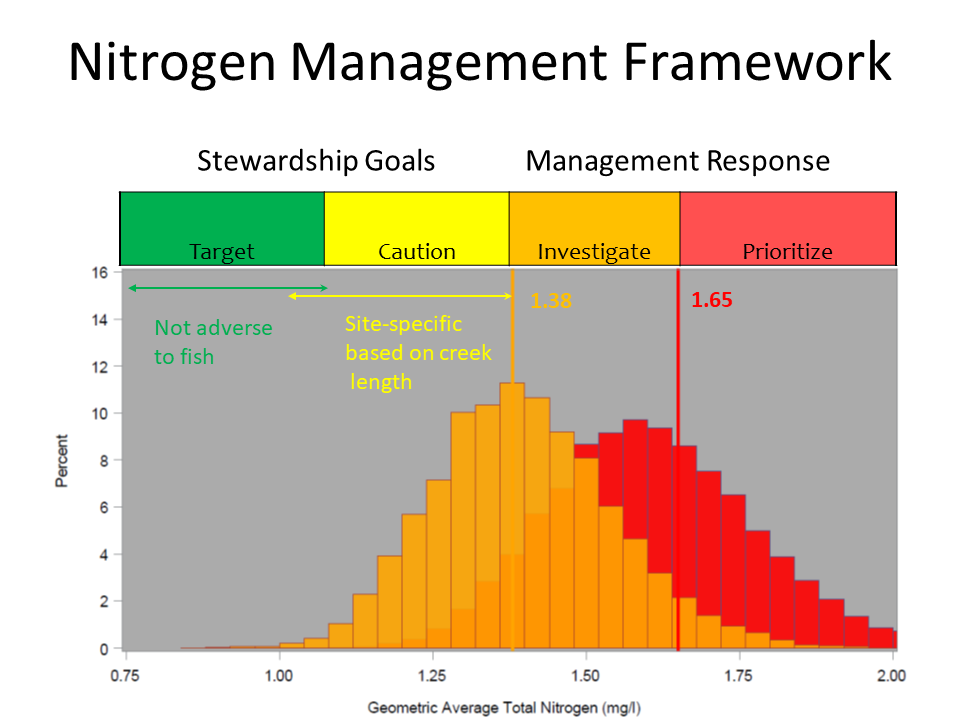

```{r setup, include = FALSE}
knitr::opts_chunk$set(
  collapse = TRUE,
  comment = "#>",
  message = F, warning = F, 
  fig.align = 'center'
)

# libraries
library(tbeptools) 
library(here)
library(Jabbrev)
library(bookdown)
library(magrittr)
library(knitr)
library(mapview)
library(plotly)

bib_scrp(here('vignettes', 'tidalcreeks.Rmd'), bib_new = here('vignettes', 'tidalrefs.bib'), ext_bib = 'https://raw.githubusercontent.com/tbep-tech/tbep-refs/master/bibs.bib')

# spelling::spell_check_files(here("vignettes", "tidalcreeks.Rmd"))
```

## Background

Dashboard: https://shiny.tbeptech.org/tidalcreek-dash/

Tidal creeks or tributaries are essential habitats in the Tampa Bay Estuary and serve as important focal points for understanding watershed inputs that affect water quality. A fundamental goal of the Tampa Bay Estuary Program is to develop effective nutrient management strategies to support the ecological function of tidal tributaries. In partnership with Sarasota Bay NEP, Coastal & Heartland NEP, and local government and agency stakeholders, preliminary methods have been developed for assessing the health of tidal tributaries for fisheries based on exceedances of nitrogen concentrations [@tbep0216;@tbep1319]. These assessments can support tracking of water quality management goals and can help refine restoration and management plans in priority tributaries, including those in need of hydrologic restoration that can support critical nursery habitats for sportfishes.

The tbeptools package includes a [simple features](https://r-spatial.github.io/sf/articles/sf1.html) spatial data object of the population of tidal creeks in southwest Florida, called `tidalcreeks()`. This includes `r nrow(tidalcreeks)` polyline features designated by a water body ID (`wbid`), creek id (`JEI`), and [FDEP class](https://floridadep.gov/dear/water-quality-standards/content/surface-water-quality-standards-classes-uses-criteria) (`class`, 1 for potable water, 2 for shellfish harvesting or propagation, and 3F/3M for freshwater/marine fish consumption, recreation, propagation and maintenance of a healthy, well-balanced population of fish and wildlife).

```{r}
mapview(tidalcreeks, homebutton = F, legend = F)
```

The tidal creek assessments use data from the FDEP [Impaired Waters Rule](https://www.flrules.org/gateway/ChapterHome.asp?Chapter=62-303) database, currently for run 56 available [here](http://publicfiles.dep.state.fl.us/DEAR/IWR/).  This includes data through January 10th, 2019. Raw data from the IWR database required for assessment of the population of tidal creeks in southwest Florida is provided in the tbeptools package in the `iwrraw()` data object.  

## Assessment

Similar to the [water quality report card](https://shiny.tbeptech.org/wq-dash/), tidal creeks are assigned to categories within a management framework intended to serve as both a mechanism for evaluating data relative to the need for regulatory action, and to identify stewardship goals that, if properly pursued, preclude the need for any regulatory actions.  These categories were based on fish as a biological response indicator.  Additional indicators that may be more sensitive to elevated nutrient concentrations have not yet been identified and are an area of current research.  Tidal creeks are assigned to one of four categories:

<span style="color:#33FF3B; text-shadow: 0 0 3px #333;">__Monitor__</span>: Creek is at or below nitrogen concentrations that protect individual creek types within the larger population of creeks.

<span style="color:#F9FF33; text-shadow: 0 0 3px #333;">__Caution__</span>: Creek nutrients showing signs of elevated nutrient concentrations that may increase risk of eutrophic condition.

<span style="color:#FFA500; text-shadow: 0 0 3px #333;">__Investigate__</span>: Creek nutrient concentrations above margin of safety to protect creek from potential impairment.

<span style="color:#FF7F50; text-shadow: 0 0 3px #333;">__Prioritize__</span>: Creek nutrient concentrations have exceeded regulatory standard for associated freshwater portion of tributary indicating that actions are needed to identify remediative measures to reduce nutrients to the creek.

Conceptually, these thresholds appear in the figure below.

```{r, echo = F, fig.cap = 'Scoring rubrik for tidal creeks based on nitrogen thresholds.', out.width = '80%'}

```

The Prioritize category was defined based on Florida's freshwater stream numeric nutrient criteria (NNC).Two different freshwater stream NNC are applicable to our region; the West Central NNC of 1.65 mg/l and  Peninsular region NNC of 1.54 mg/l. The histograms in the above figure represent a range of annual geometric mean (AGM) nitrogen concentrations associated with the Prioritize and Investigate categories which are based on the NNC. In the example above, the maximum expected distribution of AGMs not to exceed of 1.65 mg/l with a 1:3 exceedence probability (as defined in F.A.C. 62-303) was generated using monte carlo simulation and the highest observed standard deviation from data collected during the first creeks study. The Investigate category was then defined as an explicit margin of safety by adjusting the distribution to find the grand geometric average that would result in a 1:20 chance of exceeding 1.65 mg/l. Assignment of a creek into the Caution category depended on a creek length adjustment as described below to protect smaller creeks from elevated nutrient concentrations. 

The `tidaltargets()` data object included in tbeptools includes these thresholds.  Note that the "Caution" category is a function of creek length. 

```{r}
tidaltargets
```

A temporal component is also included in the assessment, whereby the overall score considers the individual categories that were observed in the previous ten years for the period of record.  For this analysis, the tidal creek assessments include data from 2008 to 2018 coinciding with the ten years prior from the most current year in the IWR period of record.  Each year of data in which nitrogen was measured at a site is given a score based on the categories defined above and an overall score is based on a frequency count for each category over the 10 year period.  The overall scores are typically assigned conservatively, such that the overall score is based on the highest category that is exceeded.  For example, a creek is assigned to the "Prioritize" (red) category if only two of ten years exceeds the Prioritize threshold, even if the remaining years are at target concentrations. Therefore, the framework can be considered a risk characterization representing the risk of the creek exceeding a particular threshold level.

## Functions

The two primary functions for the tidal creek assessments are `anlz_tdlcrk()` to obtain the scores and `show_tdlcrk()` to view an interactive map of the results.  The `anlz_tdlcrk()` function uses the included `tidalcreeks()` and `iwrraw()` datasets to estimate the scores: 

```{r}
results <- anlz_tdlcrk(tidalcreeks, iwrraw)
results
```

The results include a unique creek identifier (`id`, based on the `wbid` and `JEI` fields), the waterbody id (`wbid`), the creek ID (`JEI`), the FDEP class (`class`), and results from the assessment in the remaining columns.  The columns `monitor`, `caution`, `investigate`, and `prioritize` indicate the number of years from 2008 to 2018 that the nitrogen values were within the ranges appropriate for the creek type as specified within `tidaltargets()`.  The `score` column indicates the overall category assigned to the creek for the period of record.  Note that many creeks are assigned a `No Data` value if sufficient data were unavailable.  A summation of the four component columns (`monitor`, `caution`, `investigate`, and `prioritize`) provides the number of years for which data were available at a creek. 

The `show_tdlcrk()` function can be used with the output of `anlz_tdlcrk()` to view an interactive map of the results. Creeks are color-coded by the exceedance categories, with "No Data" creeks shown in light blue.  

```{r}
show_tdlcrk(results)
```

Several years of data included in the IWR database are used to estimate the assessment categories. A report card style matrix can be plotted using the `show_tdlcrkmatrix()` function that shows the overall creek score and the number of years of data that were used to estimate the overall score. The plot shows a matrix with rows for individual creeks and columns for overall creek score.  The columns show an overall creek score and the number of years in the prior ten years that nitrogen values at a creek were assigned to each of the four score categories.  Number of years is mapped to cell transparency.  By default, the plot shows creeks with a marine WBID (water body identifier) designation as `3M` or `2`.  This can be changed with the `class` argument (i.e., `class c('3M', '2', '3F', '1')` for marine and freshwater WBIDs). 

```{r, fig.height = 10, fig.width = 6}
show_tdlcrkmatrix(results)
```

Additional water quality parameters in the IWR database can provide context for interpreting the outcomes, e.g., chlorophyll, nitrogen, dissolved oxygen, etc. The `anlz_tdlcrkindic()` function can be used to summarize the raw data in the IWR database and returns annual geometric means of additional water quality measurements for the ten years of data that were used to define the score categories.  Averages for each year of available data at each `wbid`/`JEI` combination are returned for chlorophyll, dissolved oxygen, total nitrogen, total phosphorus, trophic state index, and several other parameters.

```{r}
results <- anlz_tdlcrkindic(tidalcreeks, iwrraw)
head(results)
```

The estimated results for the context indicators can be plotted with interactive [plotly](https://plot.ly/r/) graphics using the `show_tdlcrkindic()` and `show_tdlcrkindiccdf()` functions.  These are used in the [tidal creeks dashboard](https://shiny.tbeptech.org/tidalcreek-dash/), but are included in the tbeptools package for external application. These two functions produce plots for six of the more relevant context indicators: chlorophyll, total nitrogen, chlorophyll/nitrogen ratio, dissolved oxygen, [Florida trophic state index](http://www.lake.wateratlas.usf.edu/shared/learnmore.asp?toolsection=lm_tsi), and nitrate ratio.  Values are shown for each year in the prior ten year record for a tidal creek when data were available.  The nitrate ratios are estimated for JEIs that cover source (upstream, freshwater) and tidal (downstream) WBIDs, defined as the ratio of concentrations between the two (i.e., ratios > 1 mean source has higher concentrations). Nitrogen ratios for a given year reflect the median of all daily ratios when concentrations were measured in both a source and tidal segment during the same day. Note that a ratio of one can be obtained if both the source and tidal segments are at minimum detection.  Many creeks do not have sufficient data to esimate the nitrate ratio.

The `show_tdlcrindic()` function produces bar plots of annual averages for the six context indicators at the selected  creek.  The creek to plot is selected with the `id` argument as an integer that is used to filter results from the `anlz_tldcrkindic()` function, where the latter is passed to the `cntdat` argument.  The `thrsel` argument plots dotted red lines as references for "healthy" systems.  Each year has its own unique color.  

```{r}
cntdat <- anlz_tdlcrkindic(tidalcreeks, iwrraw, yr = 2018)
show_tdlcrkindic(id = 495, cntdat = cntdat, thrsel = TRUE)
```

The `show_tdlcrkindiccdf()` function is similar except that empirical cumulative distribution functions (CDF) are plotted as guides relative to the selected creek. This information can be used to compare the water quality conditions at the selected creek to the "population" in southwest Florida. Annual averages for each indicator and each year for the selected creek are plotted on the CDF curves.  Location of the points indicate both a comparison to the population and the trajectory of indicators over time (i.e., brown are older observations and blue are more recent).  Holding the mouse cursor over a point shows the year and holding the cursor over the line shows the percentile value from the CDF. 

```{r}
show_tdlcrkindiccdf(id = 495, cntdat = cntdat, thrsel = TRUE)
```

# References
